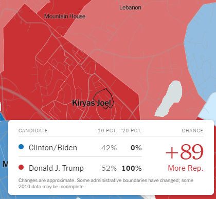

# Week 1 Reflection

In the months following the 2020 election, a lot of interesting visualizations have cropped up displaying different visualizations of the results and the conclusions that can be drawn from them. A particularly striking one that I found recently was the "[Extremely Detailed Map of the 2020 Election](https://www.nytimes.com/interactive/2021/upshot/2020-election-map.html)" from the New York Times. The raw amount of information in the map is amazing, but interestingly also lacking as large portions of the country have no data at all. This isn't really anything new to me, but is still striking whenever I see it: It is incredibly interesting to me how some areas can be homogenous while others can be notably heterogenous with regards to politics. Take for example West Virginia, where almost the entirety of the state preferred Trump by a margin of 50 points or more. Within West Virginia pretty much the only exceptions to this were larger cities like Charleston or Morgantown, and even so few areas in these liberal enclaves gave Biden margins anywhere near what Trump got. Now compare this to a state like Mississippi, which is incredibly heterogenous. Throughout the state are areas that voted for one candidate over another buy significant (> 50 point) margins, while also simultaneously having a lot of regions that were very close. It's unclear whether this heterogeneity is true to the actual results or if it is somehow a result of how the data/votes were collected, but it is still interesting to see.

Something else that I found interesting in the map were the occasional extremely red enclaves within firmly blue areas. Throughout the map you see democrat enclaves within republican-controlled areas, particularly around cities, but even in these cases Biden only had margins around 50-70 points in many places. Compare this to the towns of Kiryas Joel, New Square, Kaser, and South Williamsburg in New York. New York is known for being a democratic stronghold, even despite the strong conservative leanings of rural upstate. Yet, even in the most liberal parts of the state, enclaves appear favoring Trump with margins of more than 80 to 90 points. These aren't statistical flukes like in many parts of the country where a collective 3 votes represent 100% of the voting population of some precincts, these are hundreds or thousands of votes all for Trump, and only single digit numbers of votes for Biden. Interestingly enough, though, these towns and neighbourhoods all have very high populations of Hasidic and Orthodox Jews. New York State has the [highest proportion of Jewish people](https://en.wikipedia.org/wiki/American_Jews) in the entire country, which also makes it an interesting place to spot the various differences and disagreements among people of the Jewish faith. In this case, it's particularly interesting how a correlation would occur between politics and religion, especially one this strong within particular sects of a religion whose followers are known to typically lean [much more in the opposite direction.](https://www.pewforum.org/religious-landscape-study/party-affiliation/).

Another feature of the same visualization is the ability to see how various districts have changed from 2016. Interestingly, looking at New York again, much of the more conservative parts of the shifted toward voting democratic  with only a few exceptions: Much of New York City, which shifted more conservative, and the Hasidic and Orthodox Jewish communities I mentioned earlier, which also shifted significantly conservative. With regards to NYC shifting red, if I had to take a guess as to why, the fact that the city is a strong democratic stronghold means many democratic voters may have decided not to vote expecting the result to already be in their favor or maybe republican voters that hadn't voted in 2016 were much more fired up to come out and vote in hopes of securing republican electoral votes in what is typically considered guaranteed democratic votes. That said, the part here which I find most interesting is what happened with Hasidic and Orthodox Jewish communities. In 2016, many of these communities were much more diverse with regards to presidential vote distribution. Most notably, in Kiryas Joel, New York, the races were much closer in 2016 than they were in 2020. In 2016, Trump's margins over Clinton in Kiryas Joel were only in the range of 10-15 points, but yet in 2020 these margins increased drastically, favoring Trump by up to effectively 100 points in some districts. This precinct reported 261 votes for Trump and 1 vote for Biden in 2020, despite Trump having only a 10 point margin there in 2016: 

It would be interesting to see more results on this map as it updates, as well as comparing it to the equivalent [2016 map](https://www.nytimes.com/interactive/2018/upshot/election-2016-voting-precinct-maps.html#8.79/41.071/-74.047), as it displays interesting correlations that would be worth investigating.

## References

- [https://en.wikipedia.org/wiki/American_Jews](https://en.wikipedia.org/wiki/American_Jews)
- [https://www.pewforum.org/religious-landscape-study/party-affiliation/](https://www.pewforum.org/religious-landscape-study/party-affiliation/)
- [https://www.pewforum.org/religious-landscape-study/party-affiliation/](https://www.pewresearch.org/fact-tank/2016/02/23/u-s-religious-groups-and-their-political-leanings/)
- [https://www.nytimes.com/interactive/2018/upshot/election-2016-voting-precinct-maps.html#8.79/41.071/-74.047](https://www.nytimes.com/interactive/2018/upshot/election-2016-voting-precinct-maps.html#8.79/41.071/-74.047)
