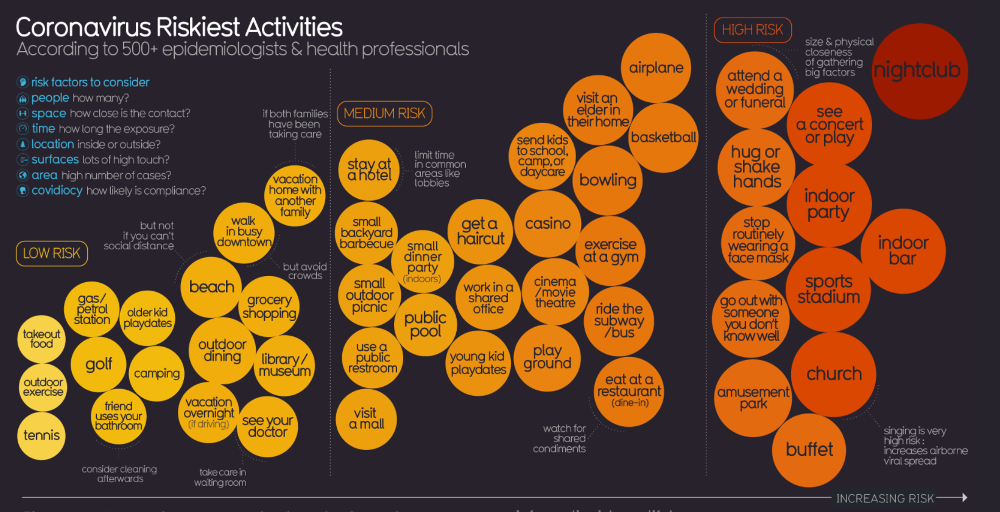

The above image is of the visualization of the riskiest activities that would expose someone to COVID-19. This visualization was taken from https://informationisbeautiful.net/visualizations/covid-19-coronavirus-infographic-datapack/#activities.

With the first week focusing on the type of data and more on the introduction of the perception of data based on the person and their preferences, there are some points that should be made about this particular visualization. At first glance, I thought the style of commenting on the visualization was very interesting. Directly commenting on an activity seem to be a warning or a piece of advice about that particular activity. These are done with a white dotted outline of an arc of the activity circle. While the visual does specify that the data was taken from 500+ epidemiologists and health professionals, it seems that the size of the circle representing each activity corresponds to the amount of professionals that agree with the riskiness. I think the size of the activity circle can be very misleading as there isn't really an explanation to what it represents and the size difference is also just so minor that it can be hard to miss; unless we compare the smaller more uniform sized circles in the "Low Risk" category to the largest "Nightclub" circle in the high risk category. Consequently, the intensity of color moving from the low risk to the high risk category seem to convey the change in risk factor much better for me. We associate red as a sign of "DANGER" and with the highest risk and biggest circle being "Nightclub" it really draws our attention and conveys that danger in a really effective way. We can also see the change in color hues when we glance at the two ends of the visual: the low risk and the high risk category. With this said, I thought the idea behind the visual was pretty simple and the simplistic design here conveyed the information and data in an overall effective way.

For my reaction to the data as a consumer, I think that this data further supports the importance of being safe right now. The creator of this visual had a list of factors at the top left hand corner that was taken into account when placing the activities into their respective categories. I think as a consumer I'd like to further develop or add an additionally visual indicating the severity of the different factors for each individual activity. 
