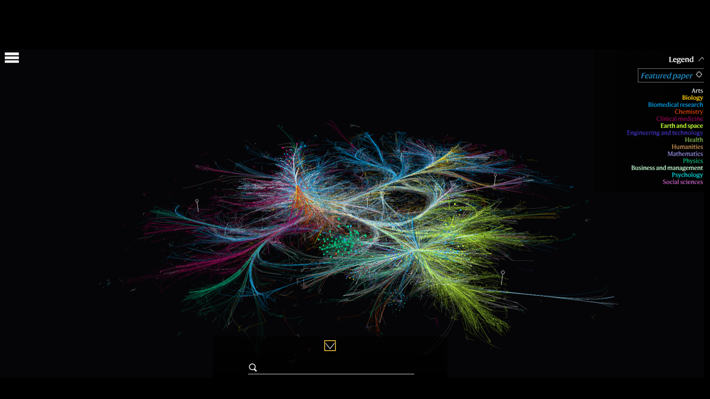
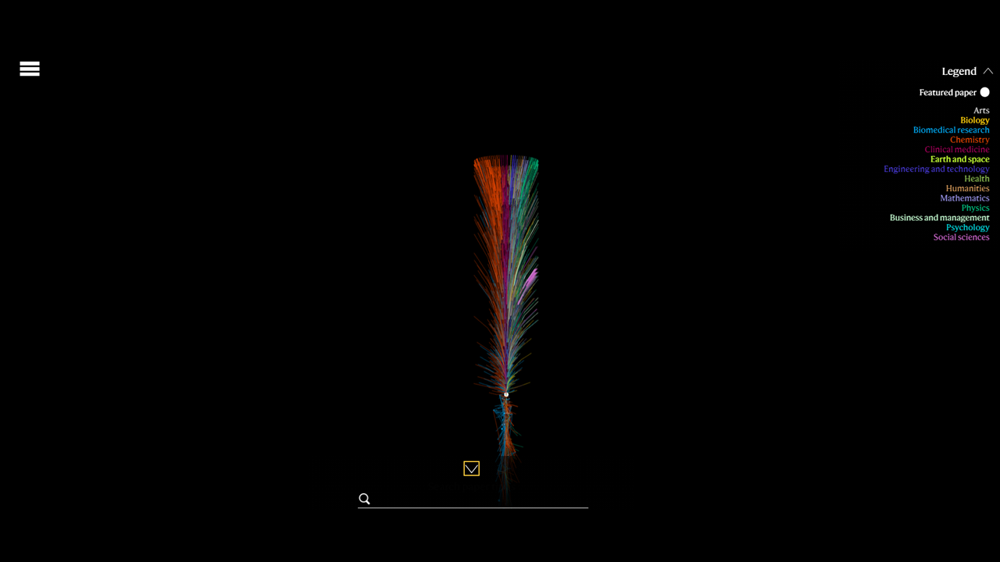

**Adrian Orsuzlak's Week 1 Reflection**
===
Summary and Visualization Details
===

The visualization presented is from a Nature journal article published on November 6, 2019 titled *Nature’s reach: narrow work has broad impact* in celebration of the journal's 150th year anniversary (Citation below). This article took 88,637 *Nature* papers published from 1900 to 2017 into a data set and set to examine the diversity of papers being cited or referenced in the papers from the data set. The goal of this visualization focuses on examining the interdisplinary exchange of ideas to lend to the notion that interdiscplinary thinking leads to new ideas and progress in the sciences, and the importance of multidisciplinarity in scientific progress. It can be concluded that the visualziation, although containing some elements of enjoyment, was made under the goal of presentation. The visualization certainly achieves this goal in showing the interconnectedness of the papers published in *Nature*. Much of the statistical data and analysis of interdiscplinarity, multidiscilnarity, and cross-disciplinarity is lost without reading the associated article. Overall, the visualization does an amazing job at showing how different sceintific ventures and research lead to the development of new ideas and research in the scientific community generally.

This visualization is a network, with the node items being represented as one of the papers of the data set and the links being representative of the references and citation data between papers in the data set. The larger the node, the more co-citations that particular paper has. A legend is included which indicates the specific discipline of the publication. For example, gold represents Biology papers whereas dark green represents Physics. The visualization also contains some featured papers. These featured papers can be visualized further to examine how their reserach impacted reserach in other papers, and by proxy other fields, every year after the original paper's publication. When examining a featured paper further, these visualization also are a network with node items being represented as papers, links being represented as the references and citaion data between papers in the data set, and a set of rings which indicate the year of publication. The size of the node still indicates the number of co-citation a particular publication has. 

Improvements Moving Forward
===
Readability and distinction are the two notable areas that should be improved upon this visualization, whether to edit the current visualization or to note should a similar visualization be made in the future. Regarding readability, the mouse and key movements often times feel very sensitive and choppy especially when exploring a data point that is not as big. This makes keeping track of a paper or a link difficult. Improving this feature in some way would make browsing and reading the visualization much less cumbersome. Regarding distinction, the authors of the visualization made it easy to identify which paper was being viewed by highlighting the data point when selected. The opacity of the lines, along wiwth the readability issue, makes examining the links between papers very difficult. Again, this is especially difficult regarding other important but less prominent papers. When styling each paper to have a visualization similar to the featured papers would be nice, the imapct of this for evevry paper may not be useful nor widely used for each paper. A more viable solution could include highlighting the links connecting to nodes, along with the data point node, to better examine the effect of the paper and the research it inspired or was inspired by.

Images
===

This first photo above is of the entire visualization.

This second photo above is of the visualization for the featured paper *Molecular Structure of Nucleic Acids: A Structure for Deoxyribose Nucleic Acid* published in *Nature* in 1953.

References
===
1. [The link to this visualization can be found here](https://www.nature.com/immersive/d41586-019-03165-4/index.html)
2. [The link to the Nature paper that discuss more about the visualization can be found here](https://www.nature.com/articles/d41586-019-03308-7)
