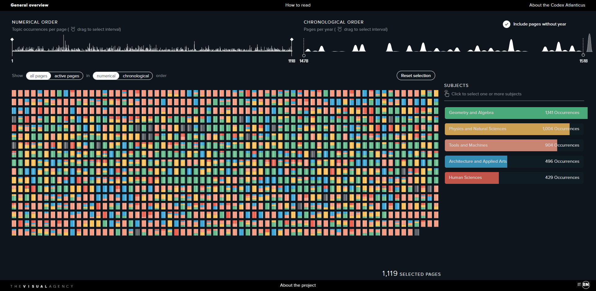
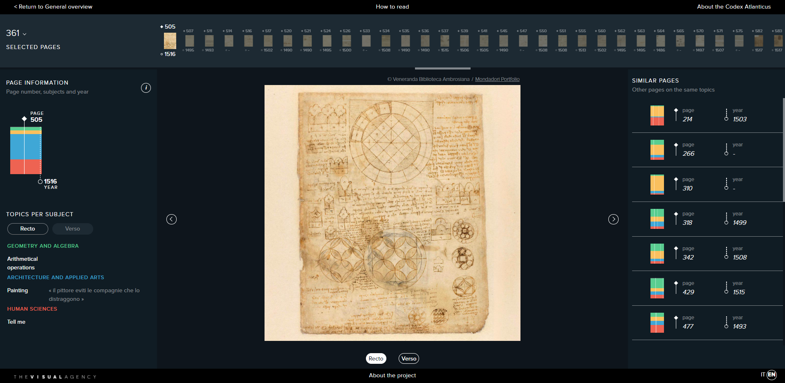

# Week 1 Reflection
For this initial reflection I wanted to actually use a vis I found during class last Thursday that I found absolutely incredible and wanted to share. 
[The Codex Atlanticus](https://www.codex-atlanticus.it/#/) is the largest exisitng colleciton of original drawings and texts by Leonardo da Vinci and is beautifully
visualized and freely accessible.
I want to begin by focusing on the organization of the User-Interface. For such a complex amount of filterable options and interactivity it's impressive how intuitively everything was implemented. The included introductory guide feels optional as immeaditately I felt a sense of familarity with the controls. I also appreciate how selected filters grey-out page selections in oder to direct the user. The organization and muted color theme of the application allows the controls to stick out to the user. This is all true for button and interactable objects. Once selecting an option I appreciate the animations the developers employed whether for scrolling through indiviual pages or when reloading the entire collection. I feel as though the intention is to capture as close a sense to a living, breathing document.
I found this application inspiring when dealing with complex controls and managing application systems. As an aspiring software engineer seeing the use of color and space can drastically impact the user experience. This can be seen with the color coding of subjects to allow the user to see the frequency of them throughout the collection and I find it intriguing simply as a visual in of itself. I feel this was a strong example to start with compared to other visualizations I've seen recently and I'm excited to explore more and suprise myself further!
