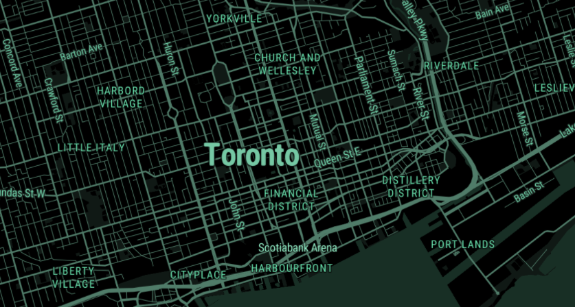
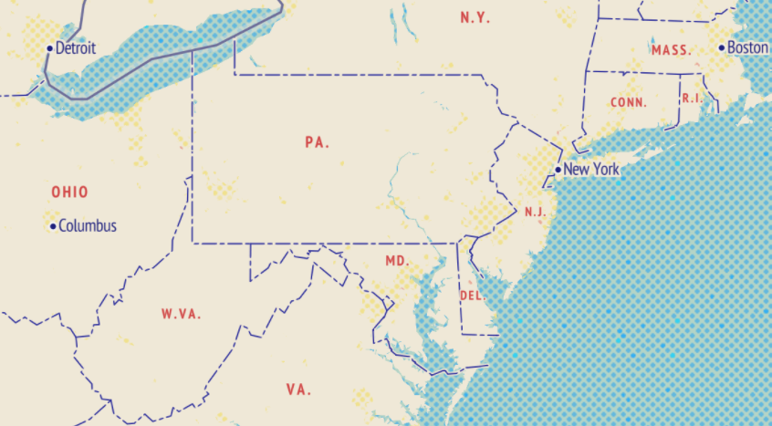
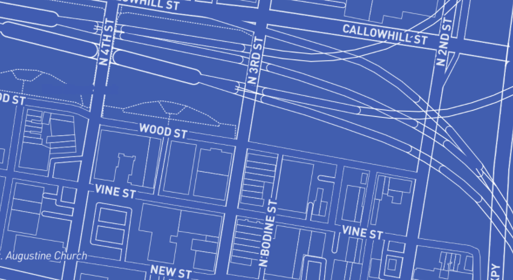
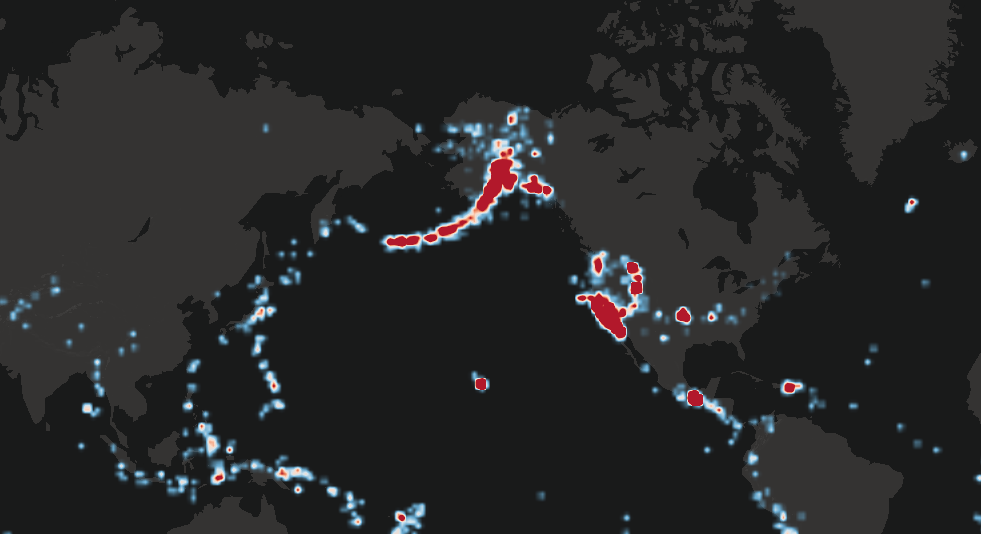

In last B term, I did my MQP in computer science and the top was finding out the people's movement pattern after COVID-19. 
My teammates and I used the MapboxGL-Jupyter library to draw the maps as we were coding in Python.
However, when I searched for the tutorials online for MapboxGL, I found that most of
the tutorials were related to Javascript. Then I realized that MapboxGL library was
initially developed for JS and web. Now I am taking the data visualization course which
primarly focuses on making visualizations in JS, and I think it is a good chance to learn
more about MapboxGL.

MapboxGL is a powerful library to render maps for web development. There are several
styles that are available to developers. The followings are some examples.

Decimal:

Standard:

Blueprint:

Heatmap:

Because to create a map in MapboxGL there are many parameters to fill in, it is very
flexible and powerful. This is why MapboxGL is such a popular library that people even
developed a Python version for it.

Resource 1: https://www.mapbox.com/gallery/

Resource 2: https://docs.mapbox.com/mapbox-gl-js/example/heatmap-layer/
