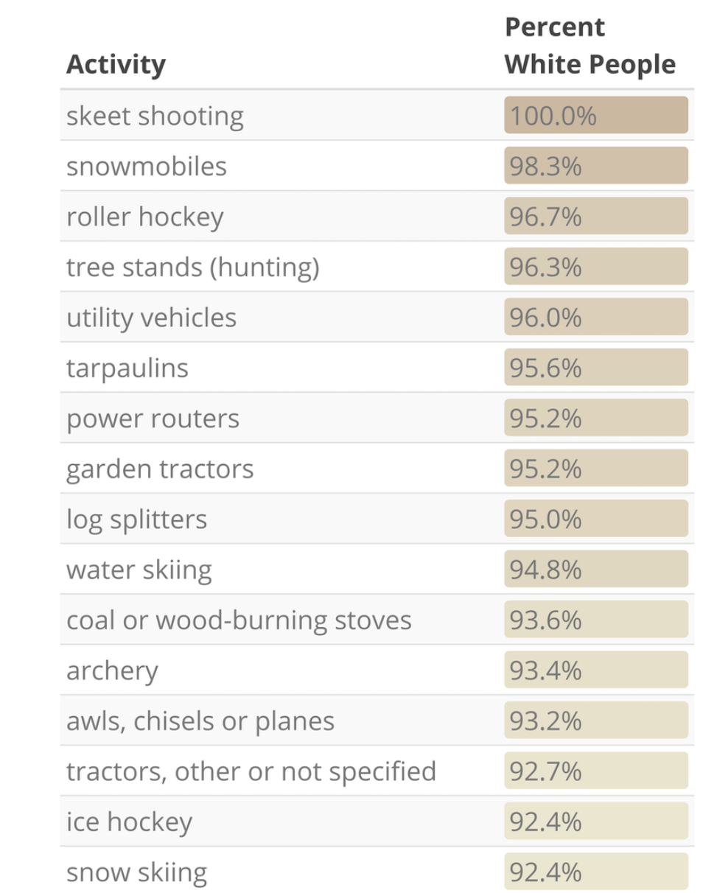

# Reflection - Week 1

For my reflection I chose a page from the Human Rights Campaign's (HRC) 2020 NCOD (National Coming Out Day) Youth Report, I remebered 
reading their youth report in 2018 and liking the graphics, so I sought out the most recent report that they published. The 4th page 
of the report is covered in graphics and visualizations of the make up of teenagers that are "out." The data comes from the HRC's own research.

This is a good example of exploratory visualization, giving the reader a general understanding of who is "out." In my opinion, the best part of the visualization
is how immediately available all of the data is. I am really imporessed with how all of the information is succinctly presented, 
the reader can quickly glance at the page and get a solid understanding, and each part of the visualization also
includes text going into further detail. My one compaint for the visualazation would be that I would like to be able to see more exploratory
information, more breakdown of the populations. For exmaple, I would like to see chart one, the "overal out chart", as it relates to every
category mentioned in chart 2.

Source: https://assets2.hrc.org/files/assets/resources/NCOD-Youth-Report.pdf?_ga=2.144777396.1223362868.1612800760-1034492289.1612800760
