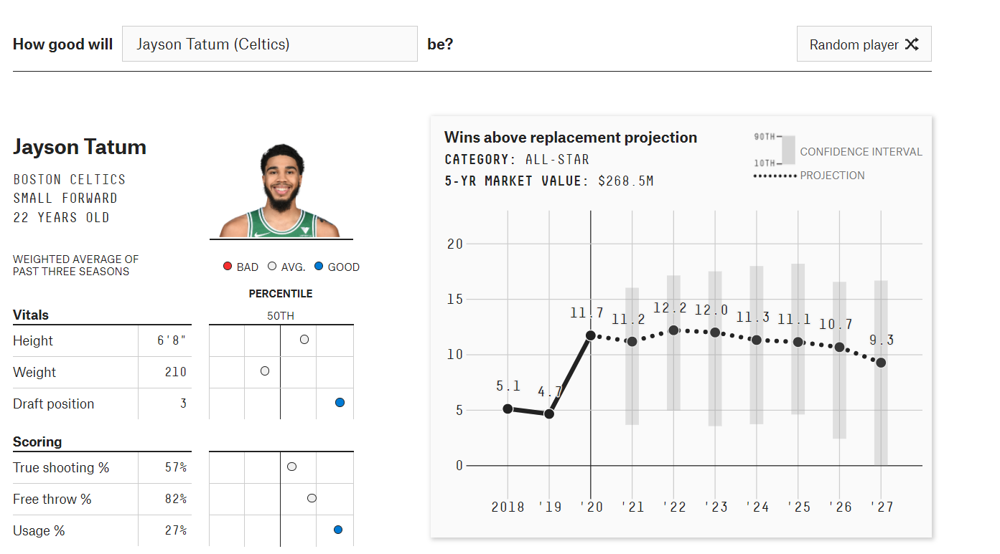

# Reflection, Week 1

**Link to vis site**:
https://projects.fivethirtyeight.com/2021-nba-player-projections/jayson-tatum/

For the first week of reflection, I chose a subject which I've gotten into the past year. Data visualization of sports stats and basketball!

In this reflection I want to ponder the possible impacts from a visualization like this on the NBA and the world as a whole. There won't be many facts in here but my opinions and what I observe from the site, and from my own reactions.

Below is a screenshot of Jayson Tatum, currently the best player on the Celtics according to this website at least.

## Consideration 1: Approachability

The first thing in this collection I found myself curious about was the team that I supported. Were we trending up, or down? What about my favorite players on the team? Were they as good as I thought?
To answer the first couple of questions, I used the searchbar at the top, searching for famous players and players on the Celtics. I was immediately a bit confused by the biggest chart on the page: Wins above replacement projection.
At least to me, I don't know what that means, and I'm fairly versed in sports. What is more confusing is this wins above replacement metric seems to be the metric that measures how similar the two players are to each other (at least at first glance).
After reading a separate article about the visualizations I learned that the similarity was based on all of a players stats, not the 'wins above replacement' metric. What the viz was trying to show is how this graph is likely to change based on similarities in other stats categories. This might be evident to someone like a GM or a researcher that decided what players to trade and which to keep, but not to me.

## Consideration 2: Impacts of Visualization

The second question I asked myself was what impact these graphs had on my view of players and teams. I found myself convinced that this source was reputable and that their assesments were accurate. I was surprised with how low some players were considered compared to others, and I wondered why, and if my consideration of them was skewed based on personal opinion or different media outlets stated opinion on a player. Are the numbers always top? Or do some players have intangibles that make them valuable to a team and organization that the statistical models do not cover? I'm not sure but it is defenetely the questions I would ask the creator.

## Consideration 3: Intangibles

I want to think about one example, Celtics rookie Tacko Fall, as I believe he is one of the extreme cases of something I was interested in. On the court, Tacko's stats are honestly quite lackluster. Despite this, the entire Celtics fanbase loves Tacko and wants him to stay with the Celtics. Something like that isn't reflected in a players stats sheet, but it could be reflected on a balance sheet for the organization who he is signed for. It made me realize I was interested in "which team has the most valuable players" and "what makes a player valuable" were the questions most important to me as I looked through the visualizations. 

Thats it for this week!