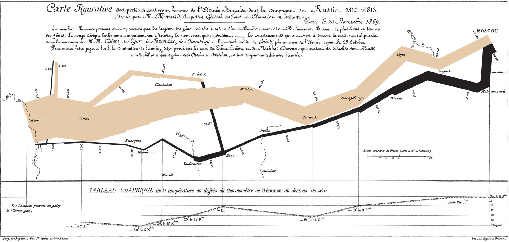

# Charles Joseph Minard's Map of Napoleon's Russian Campaign (1869)

[Image Source](https://upload.wikimedia.org/wikipedia/commons/2/29/Minard.png)

This is one of the classic examples of an effective visualization. It traces the forces under Napoleon's campaign during his disasterous invasion of Russia in 1812. It effectively communicates a number of variables, most notably the size, location, and direction of the army over time presented by lines on a map. Additionally, the temperature is recorded below the map as the major factor causing the death of the army was the lack of supplies during the bitter Russian winter. The stark losses of the army can be seen visually from the steady narrowing of the line, and provides a quick sense of scale to the numbers lost. This graphic was also generated in print far before the advent of computer based visualizations. This is therefore often described as one of the best visualizations ever created, even by modern publications.  
