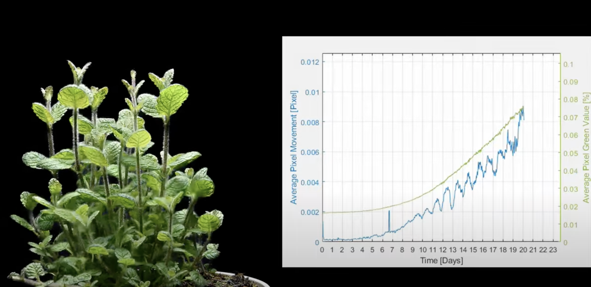

Week 1 Reflection
===

https://www.reddit.com/r/biology/comments/l1igcu/so_a_few_days_ago_i_made_a_timelapse_of_my_mint/

I came across this post while searching for plant-related data visualizations on r/dataisbeautiful, and found it very interesting for a number of reasons. Although the data visualization itself is fairly simple (two plots on a line graph), I was impressed and fascinated both by the way it was created and the results. 

As seen in the image below, this visualization shows a time lapse video of a mint plant sprouting and growing, while a graph next to it charts its progress. The graph was created by calculating the movement using optical flow between frames (shown as Average Pixel Movement (Pixel) on the left side of the graph) and the amount of green in the video (shown as Average Pixel Green Value (%) on the right side of the graph). 

Even more interesting than visualizing this plant's growth both physically and in a data-driven sense were the results. While the average green value showed a consistent exponential slope, the average pixel movement showed an equally consistent, but far more surprising result. The movement appears to follow the green value, but takes "dips" of approximately 0.002 pixels once a day, every day starting at day 10, when growth begins to speed up and become consistent. Reading through the comments led me to believe these dips aligned with the plant's circadian rhythm, which was interesting to me since (a) I had never considered circadian rhythm as relating to plants and (b) the post indicated the growing light was on 24/7, which contradicted my understanding of circadian rhythm as being largely driven by periodic external light/dark sources [1]. With further research I found the article "Circadian Rhythm of Circumnutation in Inflorescence Stems of Arabidopsis" [2] which identifies "a role for a circadian clock in the regulation of circumnutation [growth] based on genetic analysis of Arabidopsis" and indicates that plants undergo daily fluctuating speed even under constant light conditions. 

[1] https://www.ncbi.nlm.nih.gov/pmc/articles/PMC6751071/ 
[2] https://academic.oup.com/pcp/article/46/8/1423/1875051
