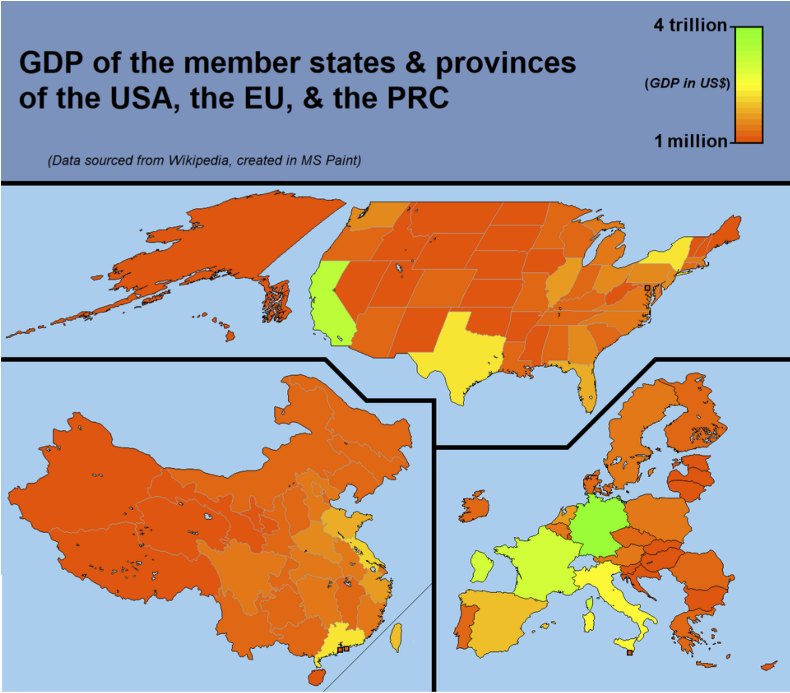

<h1>Week 1 Reflection</h1>
<h3>Reflection type: Viz Review</h3>
<h2>VizSrc: https://www.reddit.com/r/dataisbeautiful/comments/ldu42x/oc_comparative_2020_gdp_usa_eu_prc/</h2>

<h2>Review:</h2>
<h3>I thought that this viz was interesting to me, mostly because of the crazy range of its scale. I thought it was interesting because while I was scrolling through /r/dataisbeautiful for this assignment I noticed this and thought it was a cool idea for a viz. I had heard about state income discrepencies before but I found this viz hard to use. I blame this on the fact that the scale spans 6 orders of magnitude and doesn't really have a large amount range. This is then made worse as the middle value of the scale is completely unknown to me, and I can only guess it is logarithmic. I learned a few things about the use of color and scale from this viz. I think that the simplist change would be to add more color brackets in the scale, shift how the color fades to change more in the lower end, and to potentially label the color sections more. I think that another modification could be to be adding animations. This could either display the GDP of a region that is being hovered over or some sort of probing tool for the viz. As a note I would also guess that the viz designer is from europe because the Europe section of the graph is much more legible, but that could also just be the data.</h3>

