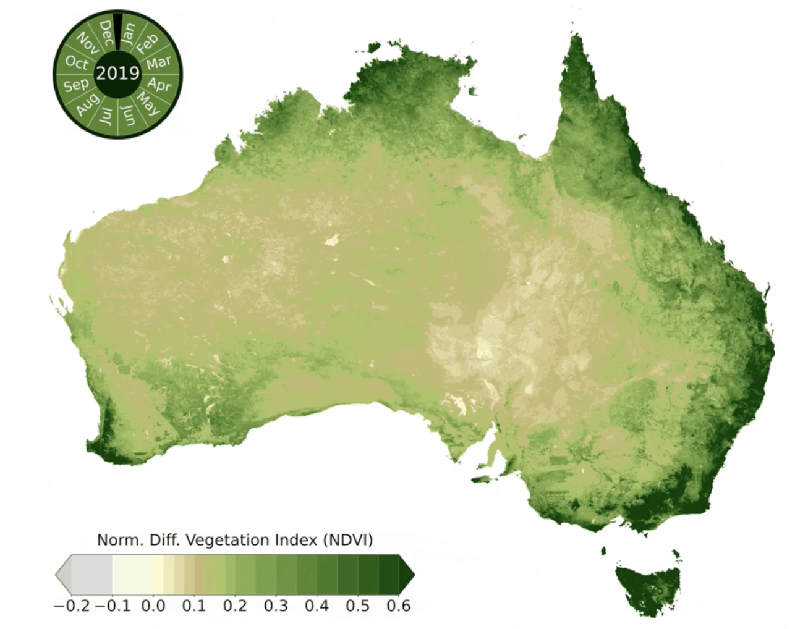
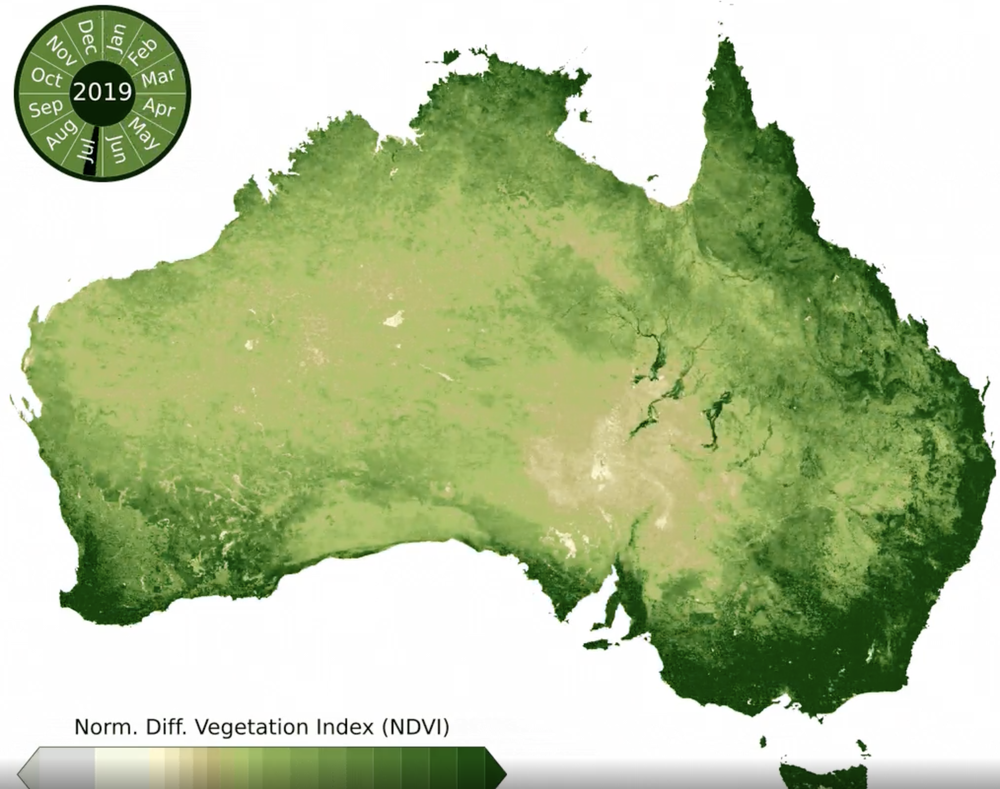

Week 2 Reflection
===

https://www.reddit.com/r/dataisbeautiful/comments/lgsy5i/oc_here_is_the_vegetation_index_ndvi_of_australia/

This visualization shows the vegetation index of Australia over the course of a year (2019). I was immediately stuck by how much the vegetation changed, and the pattern if followed throughout the year. The graphic starts in January, with only minimal vegetation concentrated on the East coast and the South-West corner around Perth. As the year progressed, the vegetation quickly darkens and moves towards the center of the country. 

The peak vegetation occurs in the summers months, primarily June through July, when the entire East coast and half the West coast achieve a NDVI score of 0.6+ before receding back. Another interesting pattern is that the concentration of vegetation seems to occur in a clockwise pattern, first appearing densest at the northernmost tip of the country in March before spreading to Brisbane on the East coast in May, then to Melbourne in the Southeast, and finally to Perth on the West coast by July, when the country is overall at its greenest. Tasmania, located to the South, has very little change in vegetation and maintained an NDVI of 0.6 for the entire year.  

To determine the vegetation levels, this visualization uses NDVI (normalized difference vegetation index), a graphical indicator that uses satellites to determine the scale of which the target contains live vegetation [1]. This graphic made me curious what differences a 2020 visualization would hold, given the devastating bushfires that burnt an estimated 46 million acres by May 2020, primarily affecting the New South Wales region [2].

[1] https://en.wikipedia.org/wiki/Normalized_difference_vegetation_index#:~:text=The%20normalized%20difference%20vegetation%20index,observed%20contains%20live%20green%20vegetation.
 [2] https://en.wikipedia.org/wiki/2019%E2%80%9320_Australian_bushfire_season
