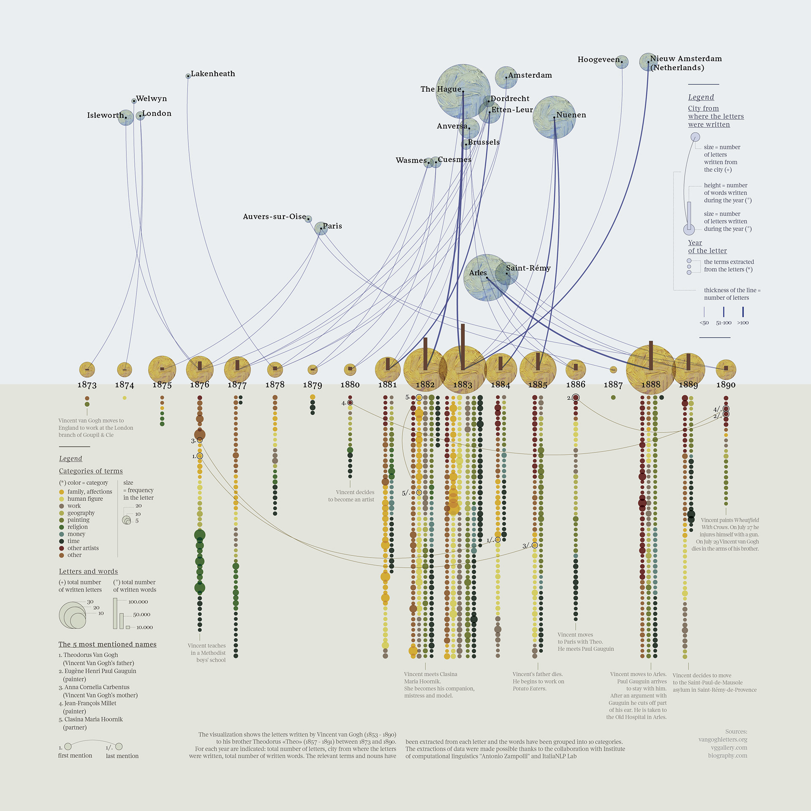

**Adrian Orszulak's Week 2 Reflection**
===
Summary and Description
===
The visualization presented is from the Behance website (the e has a bar over it) created by Federica Fragapane and ItaliaNLP Lab, who extracted the data (Citation below). From that data extraction, all known letters written by Vincent Van Gogh to his brother Leo Van Gogh were analyzed for their theme, word count, sending location, frequency, number of letters sent in a year, notable topics mentioned in the letters, and notable events in Vincent's life (such as when he decided to become an artisit). The goal of the visualization is to show the progression of lettes, their themes, artwork, and other connections that can be drawn about Vincent Van Gogh's life. These letters provide insight into Vincent's mind and aspirations that may be reflected in his paintings (citation 2). As already indicated, they also contain some artwork that is of interest to curators and fans of Vincent (citation 2). With this in mind, one can conclude that the visualization was created for enjoyment, allowing fans and aficionados alike to appreciate a timeline and content basis for Vincent's letters to Leo. The intended audience for this piece are those fans and aficionados of Vincent Van Gogh. Overall, this infographic does an awesome job at visualizing the Vincent Van Gogh's letters to Leo for the intended audience, but may be a bit overwhelming for those uninterested in the topic.

The data visualization is mainly comprised of table datasets along with some network data features. The table related dataset attributes and data displayed in two main forms: quantitative and categorical. The quantitative data is reflected in the word count bar charts that are displayed within the year circles. The categorical data is represented in the size of the circles that represent the number of letters written in a year, the size of the circles which indicate the number of letters written from a particular city, and the number along with color that concerns the topics of the letters. The network data features are represented by the nodes of a particular city and year. These nodes have links which represent when the letters were written. The links also have a weight variable associated to them which specifies the number of letters written. In addition, particular topics mentioned in letters have links which show when a topic was first mentioned to when it was last mentioned (these may qualify as a network). Legneds are included for both the top portion and bottom portion of the visualization that neatly yet effectively define what each element means. 

Improvements moving forward
===
The only area of improvement that is noted right away deals with the spacing of circles, especially for the categories of the letters. Although the circles have a bit of trasncpercy, some of the smaller circles are hearder to denote. Increasing the spacing, especially for the letter topic circles, would make it more visually appealing. Aside from this, the data visualization appears very well done and realtively easily digestable.

Images
===

Pictured above is the data visualization of Vincent Van Gogh's letters.

References
===
1. [This is the link to the visualization](https://www.behance.net/gallery/24692089/From-Vincent-to-Theo-Corriere-della-Sera-La-Lettura)
2. [This is the link to a museum in the Netherlands that provides some insight as to why one should care about the letters as mentioned within the summary](https://www.vangoghmuseum.nl/en/art-and-stories/stories/van-goghs-letters)
