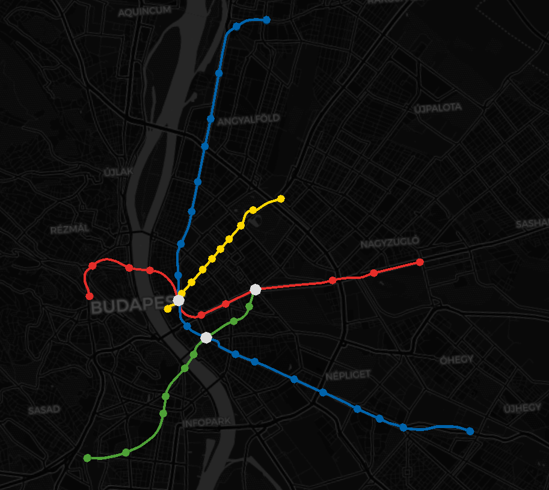

# Reflection - Week 2

For this week’s reflection, I found the website,[ Metrocyclopaedia Kontext](https://blog.csaladen.es/metro/), which visualizes various railway systems throughout the world. This site presents the data by imposing 3d models over a model of the Earth. You can easily navigate the map in a similar way to Google Earth, as the whole map is represented as a large 3d globe. For each stop, the user can learn more information about it by clicking on its dot along the rail line. Additionally, for each railway, the website presents a small blurb discussing the history of the system. The website provides three methods to look for looking up locations. First is a simple set of buttons that cycles the user through the collection of railways. The second is a look up option that allows the user to search for railways based upon the city they service and the third is a search function that allows the user to search based upon an inputted address.

This implementation of a discoverability feature is great, as it services users of different interest levels. People who wish to browse can use the button feature to navigate between cities via a list format, while users who want to see a specific city/location can use the search options. This is enhanced by the controls of the website which function near identical to Google Maps. With such a familiar mode of navigation, the website's learning curve is decreased, thereby allowing users to quickly start exploring. Additionally, the inclusion of touch controls increases the reach of potential users who can experience the website. The presentation of the website is overall pretty standard. While the dark background with the bright railways makes the information easy to spot, the overall presentation feels more like Google Earth, with some graphics placed on top. However, the minimalism is also a positive, as it allows for easy navigation. Overall, this website is a great example of successful implementation of discoverability features as it allows for users to interact with it on multiple levels. 

 
