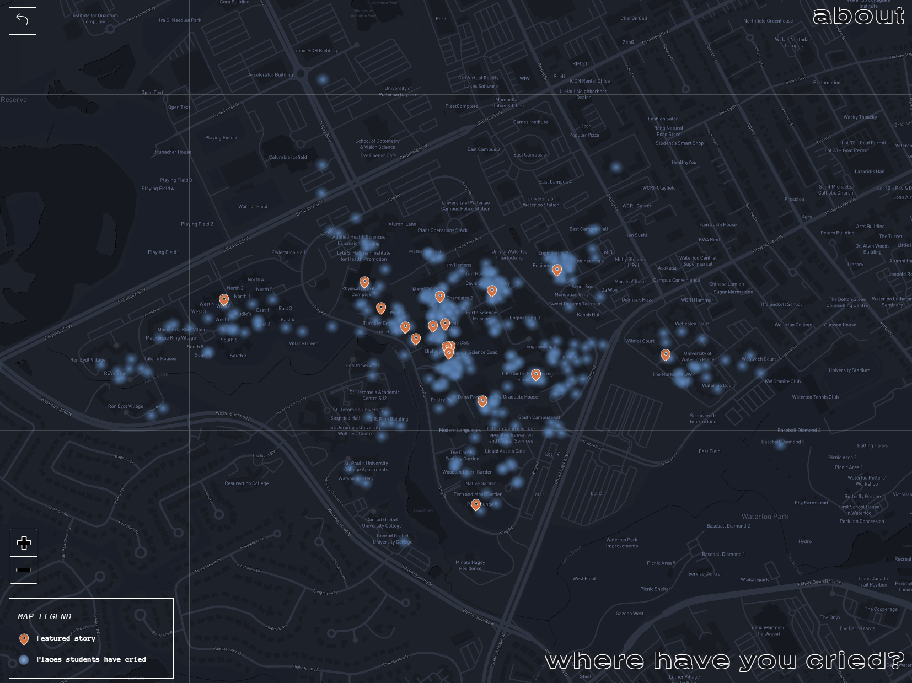
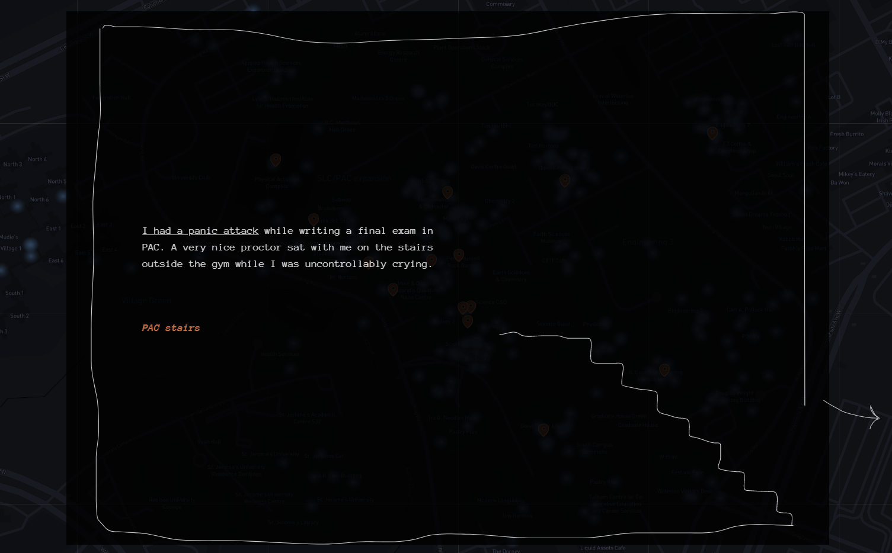

# Week 2 Reflection

Something that I find really interesting about data visualization is how varied in purpose it is. Most often when someone thinks of data visualization they think of things like charts and graphs or maps; tools for conveying some sort of conclusion about the data acquired. However, this is not the only way data visualization can be used. Not all data needs a conclusion, and not all visualizations need to be built using massive cleaned datasets.

Mental health, especially during COVID, is a serious concern. Between the health risks COVID poses directly, the transition to online learning, and just the general stress of being a student in the first place, many students are extremely stressed. In these situations its really easy to feel like you're helpless and alone. It's for that reason that it can be very helpful and therapeutic just to see that other people are also feeling the same anxiety and to be told it's absolutely fine and normal to feel emotional.

A particularly striking visual I found was [waterworks.digital](https://waterworks.digital/), a website which maps places where students have cried on the UWaterloo campus. This data is all collected with a simple form just asking for a location and consent to share it, and if the submitter decides to they can also submit a story explaining what happened. It's not particularly visually striking and it doesn't have a particularly large amount of data, but it's still a really powerful visual.

Clicking on one of the featured stories will display a small text box with the location, a short story describing what happened, and a graphic relating to the story. These featured stories really help drive home the fact that we're not alone and it's perfectly acceptable to feel emotions or just let it out. While not really part of the data per se, the graphics also have a lot of impact just as a result of their art style.

## References

- [https://waterworks.digital/](https://waterworks.digital/)
- [https://www.reddit.com/r/dataisbeautiful/comments/l3t3xx/oc_an_interactive_map_of_where_students_have/](https://www.reddit.com/r/dataisbeautiful/comments/l3t3xx/oc_an_interactive_map_of_where_students_have/)
