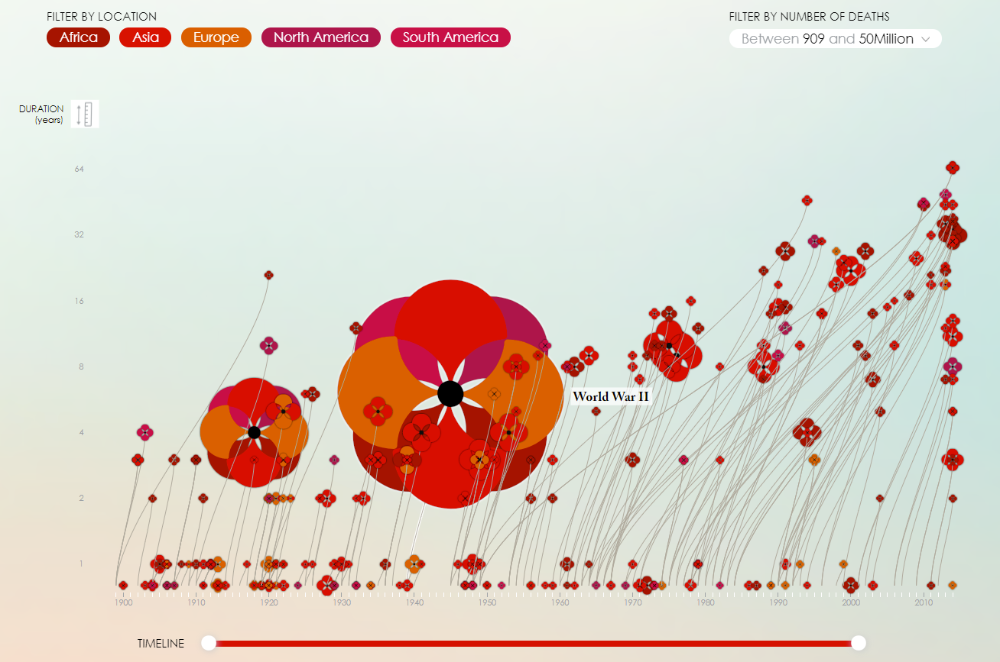

Above is an interactive visualization that can be found at http://poppyfield.org/.

The visualization itself presents data in a form of the poppy flower and when hovered over, it specifies which war each data point (in this case each flower) represents. The size of the flower indicates the number of deaths from the war that each flower represents. When clicked upon, each flower would reveal information for its respective war including information specific information on total fatalities, the duration of the war, the war participants, and further details. The visualization is great in that the user can also filter the data to only show wars by location, by the number of fatalities, and by the time if the user is looking for wars in a specific time period. 

It is important to note that the center of the flower is where the viewer should be looking at as it indicates the actual data point in relation to the axis. I thought what really drew me to this specific visualization was the choice of graphics and how interesting the poppy flower looked. Before I even got to know the data and what it was about, I think the creator really grasped the audience's attention with the way she conveyed the data. The user expereince in this vis is amazing. I really liked the interactivity and how easy it is really use and view the data. I think the choices in sliders and other capabilities is very natural for users and I don't think there was anything confusing or misleading about the presentation of the data. 

Additionally, to add more about the creativity behind the vis, we can see from the vis and data that there are several times in history where there are higher concentrations of war, therefore, for this graphic there is a higher more intense concentration of data points in certain areas. I thought it was so interesting how the creator used the stem of the poppy flower data points to spread the data and make use of the space she had rather than clustering the data in one certain area. While the stems do somewhat indicate the duration of the war it represents (the stem would start where the war began and the center of the flower data point would be where it ended), it definitely made the vis more readable in this case. 

Overall, I really enjoyed this visualization and how easily accessible it was for the viewers to understand. 
