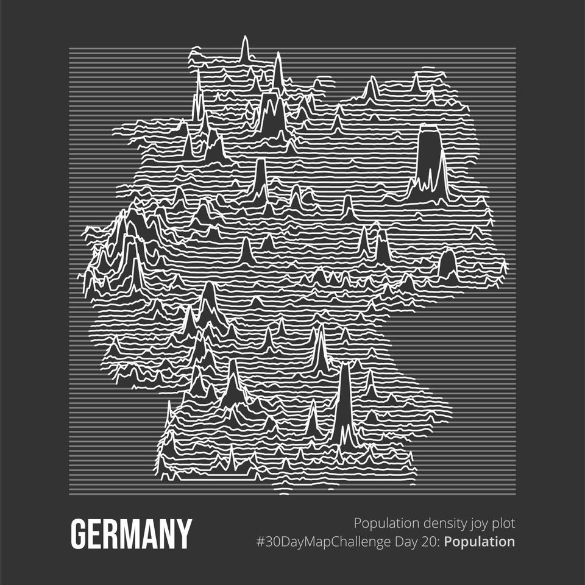

# Week 2 Reflection
This week I stumbled upon a visualization of [Germany's population density](https://www.reddit.com/r/dataisbeautiful/comments/lgrtbq/oc_germanys_population_density_as_a_joy_plot_map/) 
made by a u/koen_vde on r/dataisbeuatiful which was done using waves of various amplitudes to illusrate the spikes in density.

I think the most important and most striking design decision is choice of color, having the dark grey background juxtapose the white lines that are in bold to create the shape of the country as well as the spikes representing population density generates a lot of intrigue from the start. It makes me really appreciate the visual and even see it as an art piece. While the results show higher peaks around more cities I think it's more important to note how the visual almost reminds me of a topology map. The spacing of lines was done well to avoid confusing overlapping lines as well as give more space within the frame. Overall I really appreciated the simiplicity of this graphic and the small but important decisions the creator made during the design process.
