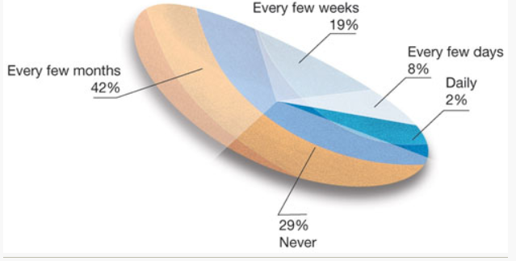
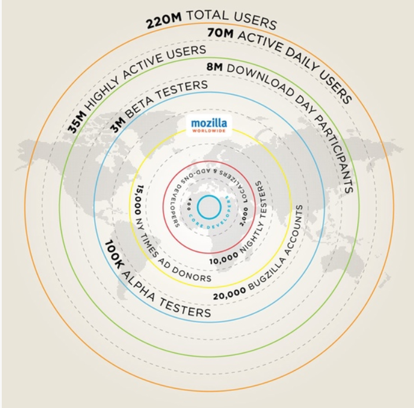
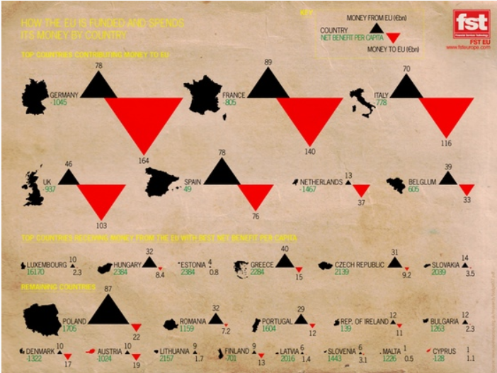

# Reflection, Week 2

Link to visualization(s)

**Link to vis site**:
https://eagereyes.org/criticism/march-chart-madness

For my second week of reflections, I decided to explore eagereyes, a website by Robert Kosara about vis and communication of data done in vis. He talks about techniques in vis and ideas that map accross the entire space. 

The page I am choosing to review is "March Chart Madness" which is a critique of Robert's...less favorite visualizations from march in 2010. Below is the sample he chose to open with...

**Reflection**

Most of this week was instructive for me rather than my opinion on a vis. 

The first photo that is critiqued is a graph of firefox users, all the way at 200 million, and compares it to the 400 active developers. There are steps in between like daily users, beta testers and so on.  However, Kosara points out that there is a constant radius inccrease between rings, even though there is not a constant difference between rings. If it is about showing the difference, then the scale should reflect it!

One more that I want to review is a graph about the EU taxes chart pictured below:

Kosara makes the argument that this chart is made in bad faith. I can't help but feel charts like this might be the cause of something like Brexit, or other political movements against the EU. Kosara references the linear vs quadratic trick in vis. The triangles in the picture are sized by their side length proportionally rather than the area. Because the area increases more as side length increases due to the area formula (b*h)/2 for triangles, this scale does not match the actual difference between things. This leads to larger numbers looking at larger areas, which makes the large negative numbers look very bad.

I do wonder if this was done intentionally in this picture and others, or maybe it just happens this way because it is easier to encode in side length and the implications were not understood by the vis designer...it is difficult to tell. 

That's it for this week!

