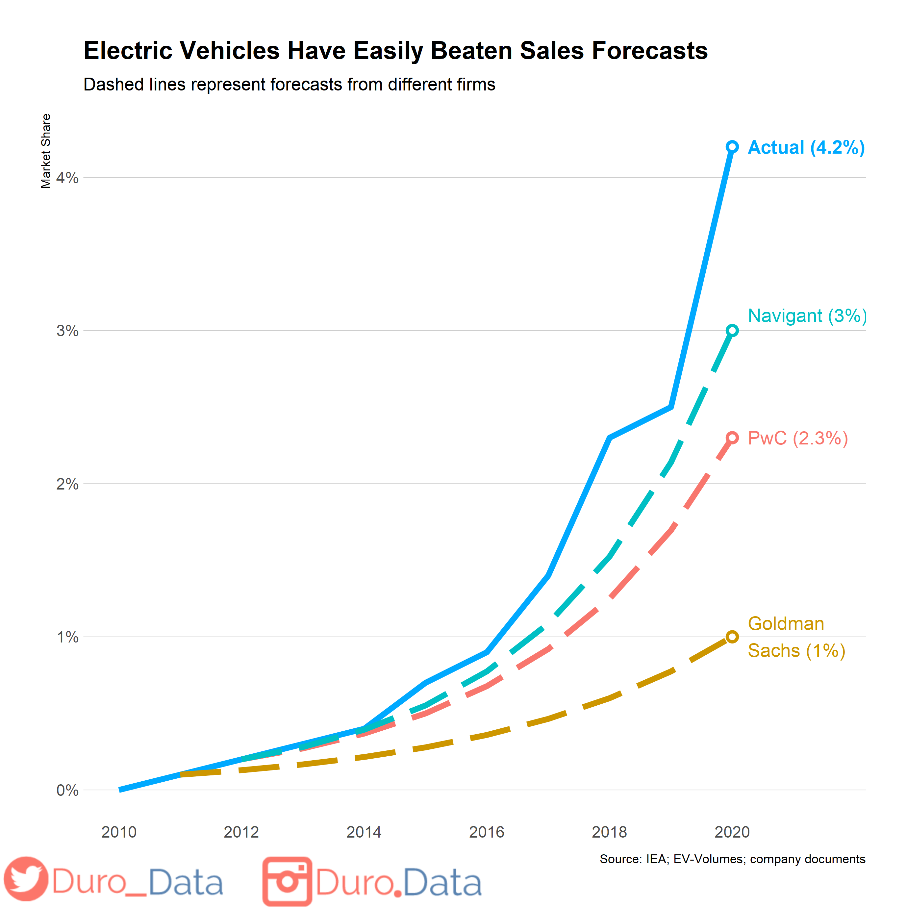
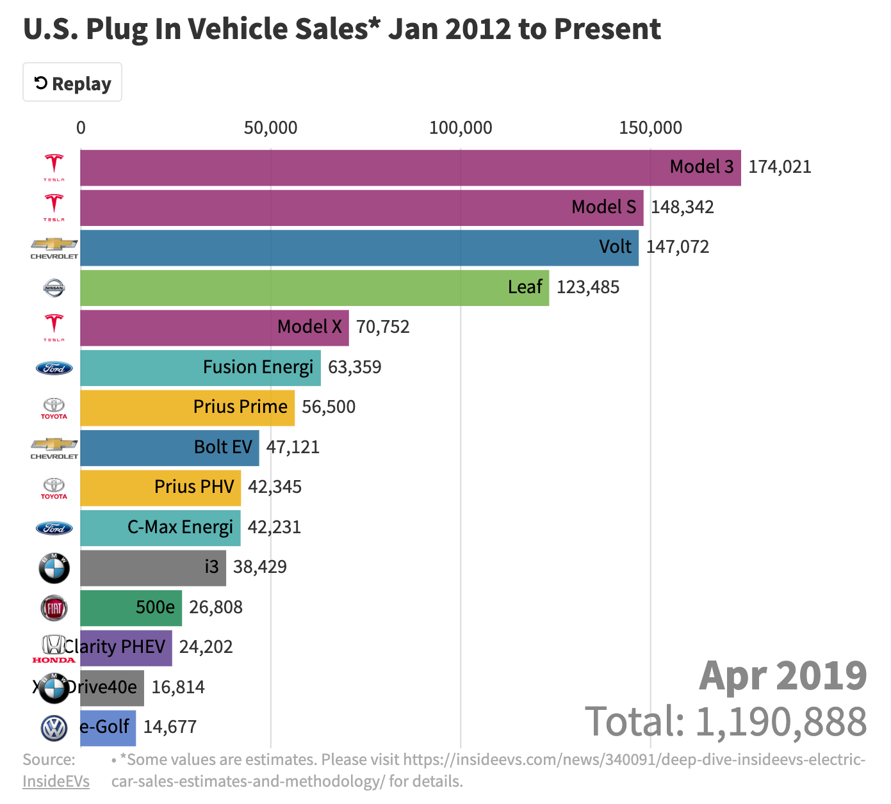

## Sales of Electric Vehicles vs. Expected Sales

## Link 
https://www.reddit.com/r/dataisbeautiful/comments/ldsqfc/oc_electric_vehicles_have_easily_beaten_sales/

## Description
With the rise in popularity of electric vehicles, and the Biden administrations' plans to electrify America, I thought it would be interesting for my weekly refelction to look at the sales of electric vehicles. This graph shows the actual sales in electric vehicle compared the expected sales by different firms.

The deviation from the predictions started around 2014, Tesla revealed its self-drivign system called Autopilot. This caused an explosion of sales which broke all sales expectation ever since 2014. In 2015, Tesla added rechargeable battery for homes, and a powerback for commercial use. Some autopilot issues in 2018 caused sales to decline, but Tesla's PR was able to recover the damage. Since 2018, the company quickly recovered and has been seen more and more sales since. It would interested to see this graph in the next 20 years, when other electric car companies have a larger market share of EV vehicles.

Here is the EV Market Share since April of 2019:

It's clear that Tesla has the advantage in market share currently, but I'm definitely curious about how this graph will look like in 10 years!

## Sources
Author's Note:
Tools: R / ggplot2

Sources: Electric vehicle market share came from the International Energy Agency and EV-Volumes (for 2020). The sales forecasts came from the PwC EV Market Outlook 2013 (on page 4).

Market share is worldwide.

https://www.businessinsider.com/most-important-moments-tesla-history-2017-2