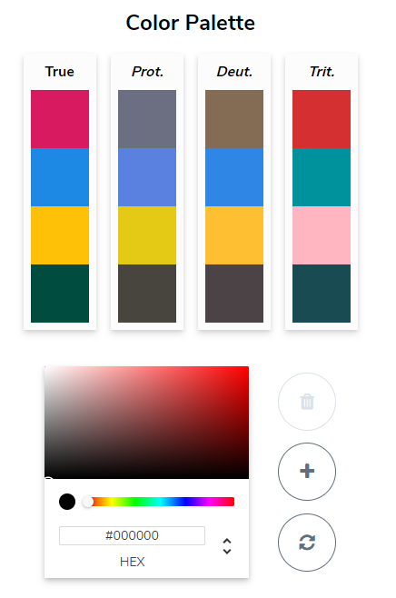
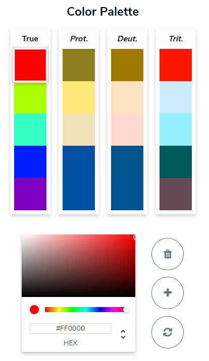
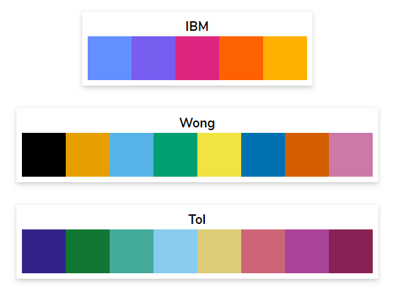

Vis link: https://davidmathlogic.com/colorblind/

I stumbled across this site while looking for a colorblind-friendly pallette to use in assignment 2. The bulk of the page is an article about colorblindness, but it has a tool that allows you to select a pallette of colors, and it simulates what that pallette would look like to people with protanopia, deuteranopia, or tritanopia.

The page also has a couple suggested pallettes, which you can click on to load into the pallette editor. You can also bookmark pallettes for later use.

Overall, this page is useful, interesting, and informative. The tool is well designed, and the only thing I can think to add to it is a button that gives a randomized pallette, which might be fun to mess around with.