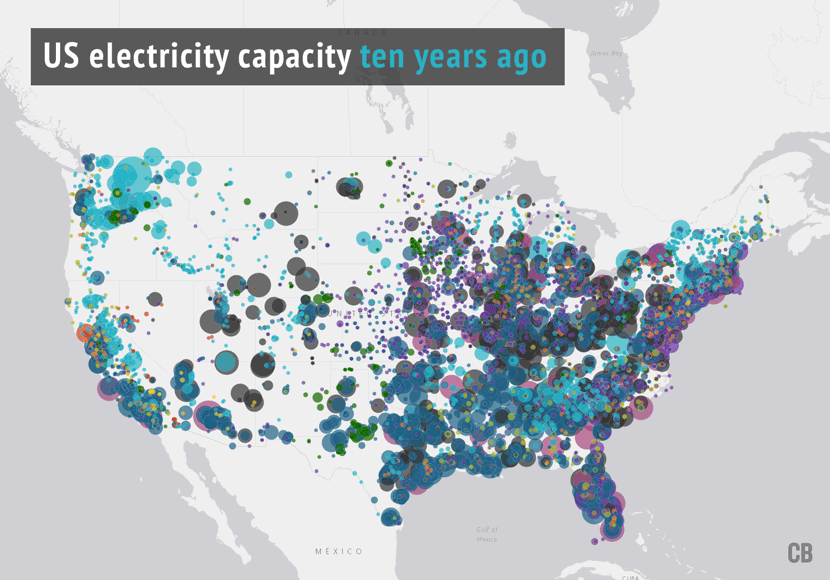

# Reflection 2: How the US Generates Electricity

## Link: https://www.carbonbrief.org/mapped-how-the-us-generates-electricity

The data viz presented here is a representation of how electricity is created in the United States. The primary categories
of electricity generation include the following: Gas, Coal, Nuclear, Hydro, Wind, Oil, Waste, and Geothermal. The radius
of each circle represents the amount of electricity that the factory produces. I really enjoyed seeing this visualization 
because I had never known that every area of the United States gets its electricity in a different method. For example, 
I had no idea that hydro generated electricity was so widely common in Washington State. In addition, I also thought it was 
interesting to note how much emphasis has been put on renewable sources of energy. The website with the viz
shows another map which detail how the United States generated electricity 10 years ago. 

USA Generated Electricity 10 Years Ago 

As you can see, there was much less emphasis placed on solar electricity, and much more of the country was heavily reliant 
on coal factories. I thought it was also interesting to think about how the local geography shaped the electrical industry.
For example, as noted in the description, nuclear plants require abundant water sources for cooling purposes. So, all the nuclear
plants are near/have access to a body of water. Similarly, the middle of the country is very flat, and so, wind generated
electricity is more common in that area. Overall, I thought this viz was very informative, and I definitely learned something
about how electricity is generated in the United States. 
