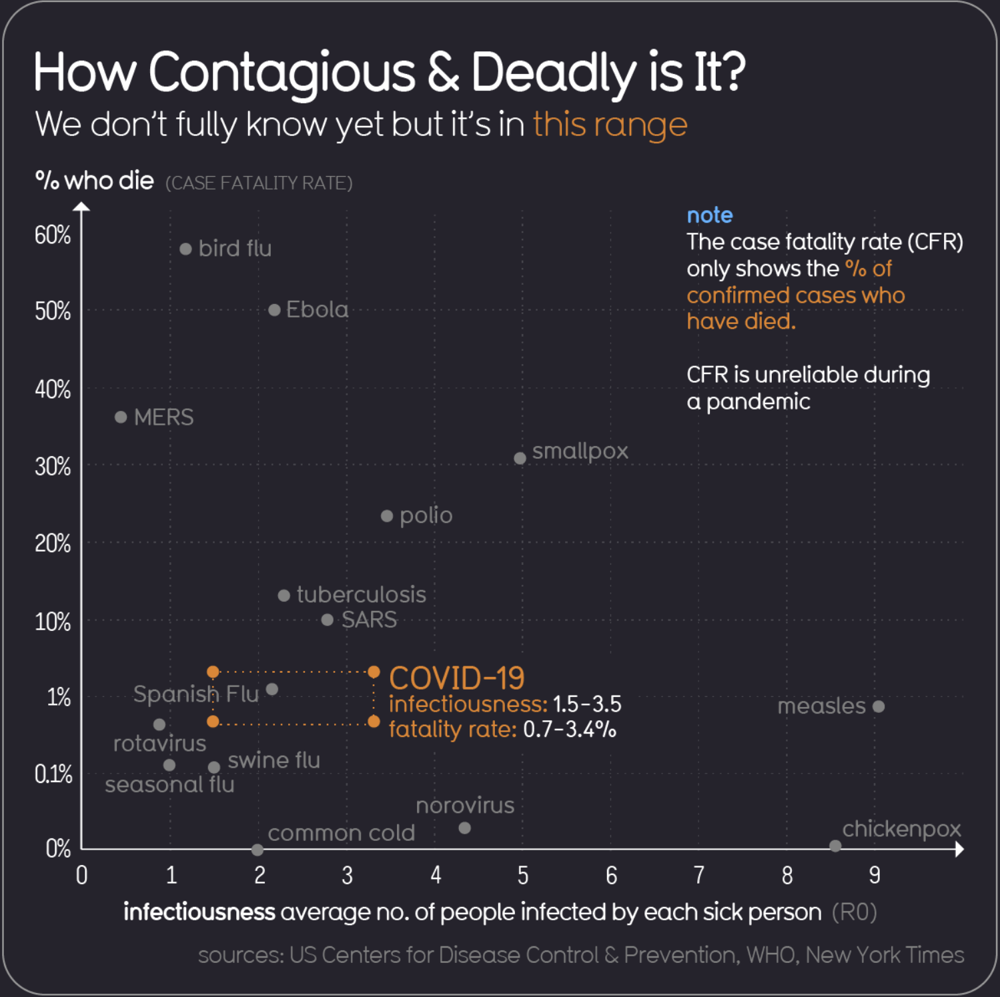

<h1>Week 2 Reflection</h1>
<h3>Reflection type: Viz Review</h3>
<h2>VizSrc: https://informationisbeautiful.net/visualizations/covid-19-coronavirus-infographic-datapack/</h2>

<h2>Review:</h2>
<h3>I chose this pack of covid data because I had never seen such a consolidated piece of visualization work with so many different options for exploring data in many ways. Among my favorit two graphs on this page are the "How Contagious & Deadly is It?" viz and the "Country comparison" tool. The comparison tool is super interesting to work with because it allows for 4 countries to be compared along a few different data sets. I also thought that the fatality range was super interesting to see because I know it is a question I had about the virus and it is somewhat enlightening. I did have two problems with the graph, first being that CFR being unreliable during a pandemic makes the conclusions from the graph also unreliable but the fact they gave a range box and noted that on the viz is super good. My bigger concern with it was the change in y axis scale from logarithmic at the bottom to linear after 10%. I think that is is a good way to fit all the data but some alert to make sure viewers notice the change is important. The compilation of all these graphs in one place is extremely impressive given their quality and responsivenes. They all have very helpful notes included with the data and all have recency tags so that viewers know they are getting updated info. Clearly the visualizers of these graphs know their visual channels because all of the data pops out with a reliable color scheme used throughout the page which made it easy to read and clear.</h3>