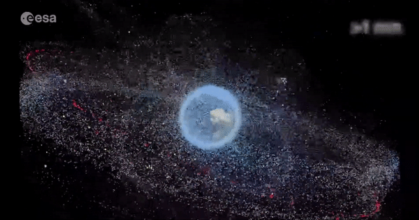

#Reflection 3: Satellite Debris
##Link: https://www.youtube.com/watch?v=wPXCk85wMSQ&feature=emb_logo

### Description
The data viz presented here is a video of the amount of space junk released in the atmosphere since 1957 to 2015. 
There are some interesting facts to note, during this period there were around 8950 satellites launched by more than 40 
different countries. Only around 5000 remain in orbit, and the rest are considered to be space junk that floats in the
Earth's atmosphere. The issue is many of the decommissioned satellites crash into one another causing debris to fall off. 
So, there are around 34,000 objects in orbit that measure 10 cm in diameter, 900,000 that measure between 1 and 10 cm, 
and 128 million that measure between 1 mm and 1 cm. While these last objects might sound underwhelming, even the tiniest 
objects can pose a severe collision hazard. This is due to the velocity of objects in orbit, which can get as high as 7 
or 8 km per second (4.3 to 5 mps), which works out to about 12875 km/h (8000 mp/h). At these speed, even small flecks of 
matter can cause serious damage to working satellites. In addition, too much debris can prevent new satellites from even 
being launched.