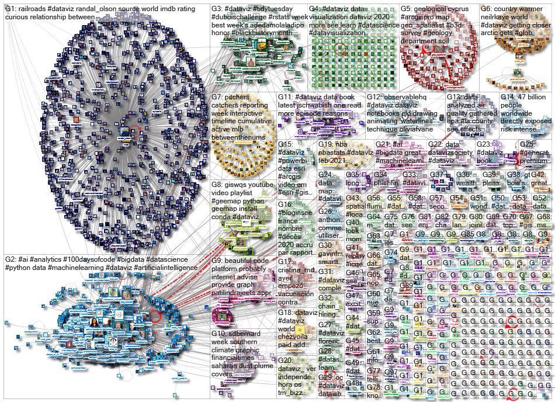
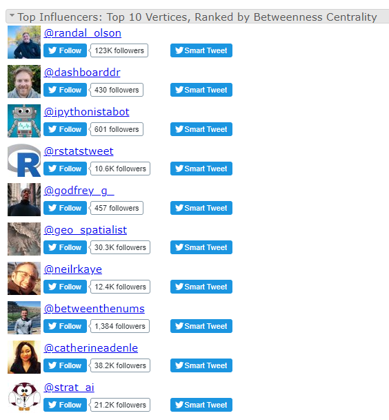
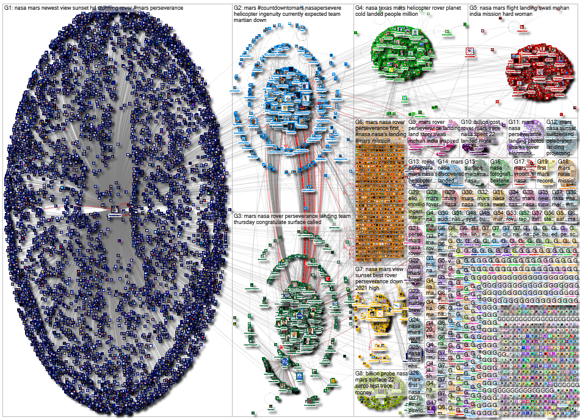
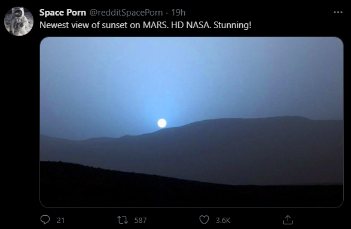

# Week 3 Reflection

A particularly interesting set of visualizations I found recently are the visualizations stored on [nodexlgraphgallery.org](https://nodexlgraphgallery.org/). This website compiles network graphs created using [NodeXL](https://nodexlgraphgallery.org/Pages/AboutNodeXL.aspx), a graph-building tool/template for Excel. A lot of the examples in the gallery are built using Twitter data, such as [this visualization](https://nodexlgraphgallery.org/Pages/Graph.aspx?graphID=249089) which displays a graph of users who came up, were mentioned, or replied to in queries for "dataviz OR datavis" beginning February 19.

It's really interesting to see not only how large clusters can form and how they interact with each other, but also how some smaller, completely (or almost) disconnected clusters form as well. Another interesting thing this page does is it also keeps track of various popularity statistics from the graph such as top influencers by number of vertices, top hasthags, and most popular URLs.

Another interesting visualization in the same gallery is [this one](https://nodexlgraphgallery.org/Pages/Graph.aspx?graphID=249265) generated using tweets gathered the afternoon of Saturday February 20 from a query for "NASA Mars".

Something interesting about this graph is actually that the most popular vertex was not a post by NASA, but by the user [@redditSpacePorn](https://twitter.com/redditspaceporn) of a sunset on Mars (which amusingly the user claimed as "the newest" despite being [taken by the Curiosity rover in 2015](https://solarsystem.nasa.gov/news/925/what-does-a-sunrise-sunset-look-like-on-mars/) and [published May 1, 2019](https://solarsystem.nasa.gov/resources/2432/sunset-at-mars-gale-crater-curiosity/)).

## References

- [https://nodexlgraphgallery.org/](https://nodexlgraphgallery.org/)
- [https://nodexlgraphgallery.org/Pages/AboutNodeXL.aspx](https://nodexlgraphgallery.org/Pages/AboutNodeXL.aspx)
- [https://nodexlgraphgallery.org/Pages/Graph.aspx?graphID=249089](https://nodexlgraphgallery.org/Pages/Graph.aspx?graphID=249089)
- [https://nodexlgraphgallery.org/Pages/Graph.aspx?graphID=249265](https://nodexlgraphgallery.org/Pages/Graph.aspx?graphID=249265)
- [https://twitter.com/redditspaceporn](https://twitter.com/redditspaceporn)
- [https://solarsystem.nasa.gov/news/925/what-does-a-sunrise-sunset-look-like-on-mars/](https://solarsystem.nasa.gov/news/925/what-does-a-sunrise-sunset-look-like-on-mars/)
- [https://solarsystem.nasa.gov/resources/2432/sunset-at-mars-gale-crater-curiosity/](https://solarsystem.nasa.gov/resources/2432/sunset-at-mars-gale-crater-curiosity/)
