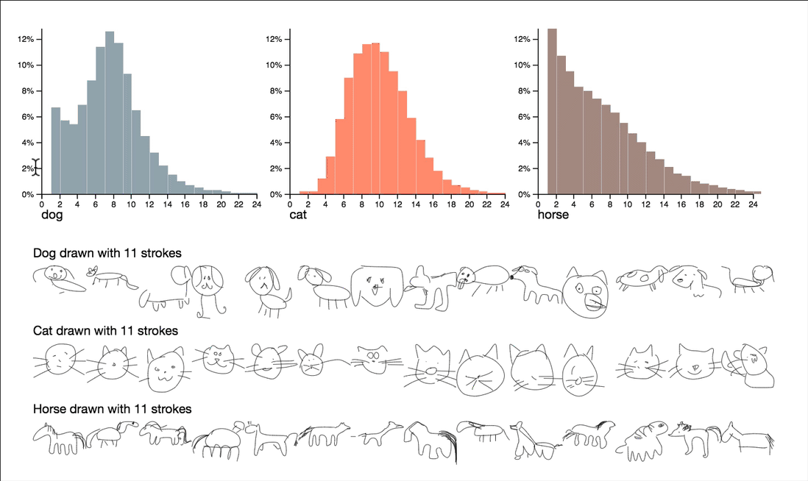

# Machine Learning for Visualization

##Link: https://medium.com/@enjalot/machine-learning-for-visualization-927a9dff1cab

##Description

For this weekly reflection, I want to dive into how Machine Learning can help us make better visualizations. This article is about a presentation made at OpenVisConf 2018 by Ian Johnson. Ian uses machine learning to help bridge the gap between computers and humans. One of his first interesting projects was visualizating how a neural networks learns the differences between a cat, dog, and a horse. The neural network was fed hundreds of different images of cats, dogs, and horses made with different amount of lines. These drawings are doodles, and the goal was for the neural network to recognize what type of animal is being drawn based on an imperfect sketch. A graph is then created base on the amount of strokes drawn per doodle, and categorized as either a cat, dog, or horse.

