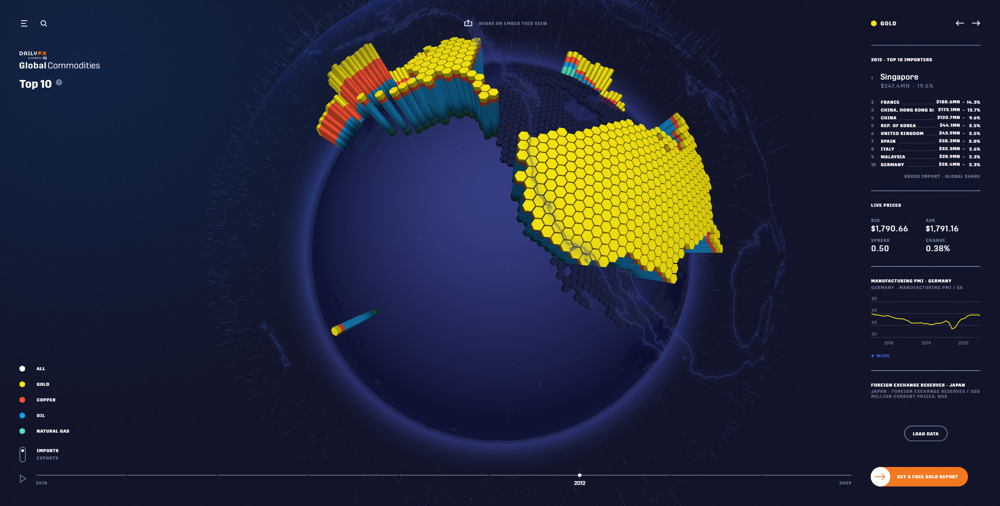

# Week 3 Reflection
This week I wanted to continue my search of finding more interactable data visualizations. What I found was really cool on a technical level.
Created by DailyFX, the Global Commodities interactive tool is an incredible 3D map of the globe with countries filled vertically based on the proportions and volume of either
their imports or exports. With a time line feature included as well I was impressed by the readability and accessibility of the tool. 
The level of detail also provided per commodity is incredibly detailed giving live fed data as well as graphical data showcasing trends which supports the time line feature.
Being able to inspect at a global or national level is incredibly intuitive. Though I am confused by one design decision which is the use of the hex shape columns and the fact
they are seperated individually. When I first started inspecting the visualization I assumed that I would be able to look deeper than the national level, whether it was state or
by region of a country. Considering the current features provided I feel as though it would be less misleading to just have the entire country be together rather than broken up
in this hexagonal patern.
