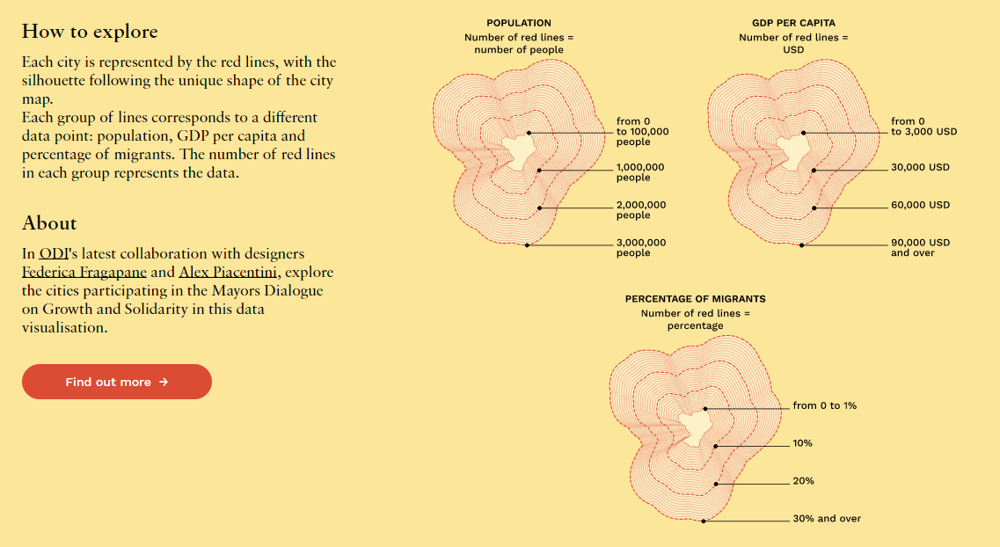

# Reflection: [The Mayors Dialogue on Growth and Solidarity](https://mayorsdialoguedataviz.odi.org/)
### Hunter Caouette
---
The Mayors Dialogue on Growth and Solidarity is a very cool viz that I found.  
It is confusing at first when you read the legend, as you ask yourself "how can these lines simultaneously represent 3 different quantitative data?" When you enter the pages for each of the cities, though, it becomes more apparent how to read the graphs. The graphs do a beautiful job displaying their information in a unique way, since they are both filling the map's volume relative to its outline, and quantifying the data with the number of lines used.  
One concern I have with these visualizations is how valuable they can be to somebody without much subject knowledge, or without a good sense for what is very high or very low.  
Especially for someone without subject expertise it is hard to know if, when looking at one city, whether that city's proportions of population and GPD, or GDP and % migrant population, etc is outside of the Normal range across the cities gathered in the dataset. One thing that I think this viz tool could do better is provide some kind of a summary graphic for each of its main features, to show what is a normal population-GDP ratio, for example, or population-% migrant ratio.  
Because loading each city's detail graphics takes you to a new page, you lose the ability to compare each cities to one another. While that may have been the intent of the designers, to get viewers to focus on the details of each city, I found it to take away from the experience as I was wondering at most times what the context of the numbers were. When you scroll down on a city's detail page you see the graphics for a number of other cities from the homepage, but it is still just their population graphics, not anything more. Even the ability to do a side-by-side comparison of two cities, like you would do when comparing hardware specs on computers, would be useful because then you could pick, say, Paris and Bristol and see how they stack up to one another.
A final note is that the city pages do contain a link to a short pdf summarizing and explaining the data for the city. This feature is both good and bad. It is helpful because it is more information to contextualize why some numbers are as low or high as they are, and because it is separated from the viz the writers can go into more detail. It is bad, however, becuase it is both hard to notice at first when viewing the city pages, and also because to view it you must load the pdf in another tab to view it, taking you away from the visual and making you switch back and forth if you want the information and the visual at the same time. A more helpful solution would have been to at least supplement the visualizations with short captions, or tooltips.

