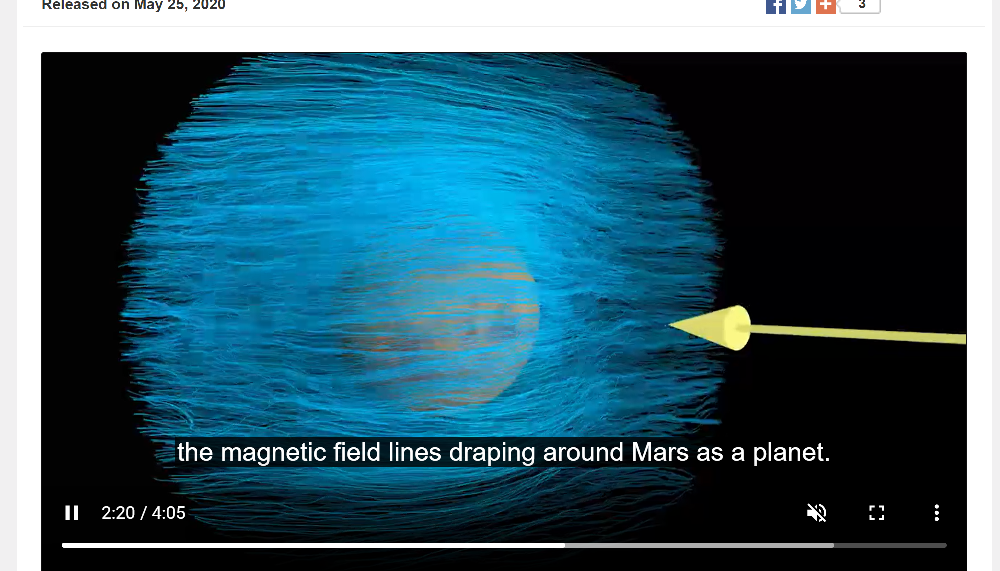

<h1>Week 3 Reflection</h1>
<h3>Reflection type: Viz Source and </h3>
<h2>First Map of Mars Electric Currents: https://svs.gsfc.nasa.gov/13625, Source: https://svs.gsfc.nasa.gov/search/?keyword=432</h2>

<h2>Space Data Viz:</h2>
<h3>I chose this source of space visuals because I was inspired by the landing of Perserverance this past week! As a kid the visualizations of
space weather, missions, and other phenomena was what got me interested in STEM in the first place. In particular it was a video at a mueseum of the Mars rovers Spirit and Oppertunity. I think that space visualizations, while they may not necessarily be data driven like the animations I saw, are hugely important because of their ability to inspire. To find some more data driven viz's I searched NASA's Goddard Media Studios and found this viz on Martian atmospheric interactions with solar wind. I thought it was really interesting because the visuals come from a very complicated dataset collected by a orbiter measuring magnetic data. They had to plot this data by mapping it to its location relative to the planet, and Im not entirely sure what the magnitude and hue of the vectors represent about atmospheric electric currents but thats more due to me not being an expert in the field than the viz. They are using this data to analyze how Mars loses atmosphere to the solar wind's ionizing radiation. I think that it would be really cool to create some visualizations to have a daily space weather report. This could teach the public more about the danger of solar flares and potentially calm some people down about magnetic field reversals. </h3>