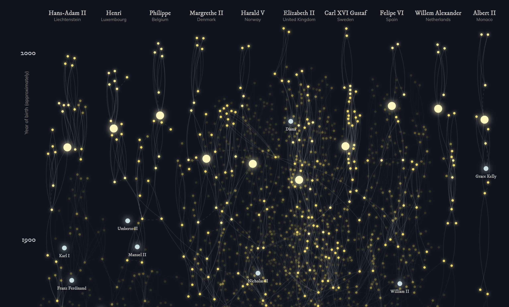

Week 2 Reflection
===

https://royalconstellations.visualcinnamon.com/

This visualization shows royal European ancestral relationships organized by current leaders of each country from the years 1000 - 2000. Parent/child and husband/wife relationships are distinguished between, and the degree of separation between a person and their relations are shown on hover. The countries represented in this visualization, along with their respective royal leaders, are Liechtenstein, Luxembourg, Belgium, Denmark, Norway, the United Kingdom, Sweden, Spain, the Netherlands, and Monaco. 

As explained on this website, a large part of what makes a family tree like this so interesting is that historically, royal families were constantly intermarrying. Such practices were used to consolidate wealth, power, and territory, and well as make legitimate claims to one throne or another. 

Examining the direct ancestors of current royal leaders shows some very interesting results. Great Britain’s royal bloodline is very dense and reach back a few hundred years, but is not currently intertwined with other countries (besides a distant Norwegian connection). Harold V of Norway, however, has connections with the royalty of Luxembourg, Belgium, Denmark, and the United Kingdom. Contrastingly, Lichtenstein, the Netherlands, and Monaco are remarkable in that they have no ties to other countries, with a clear direct bloodline. 

Several notable names exist in this visualization which makes for interesting connections. For example, Pauline of Wurttemberg, who lived in the 1800s, is directly related to six of the current royal leaders. I also learned in a blurb on hovering over Queen Victoria of England that she is known as the "grandmother of Europe" - her nine children married into royal houses across Europe, and five royal leaders can trace their ancestry directly back to her. More additional names and families are interesting to explore: I investigated the ancestry of Grace Kelly, American actress and princess of Monaco, the relation (by marriage) of Princess Diana to historical figures, and the genealogical history of the Tudors and Stewarts. 
