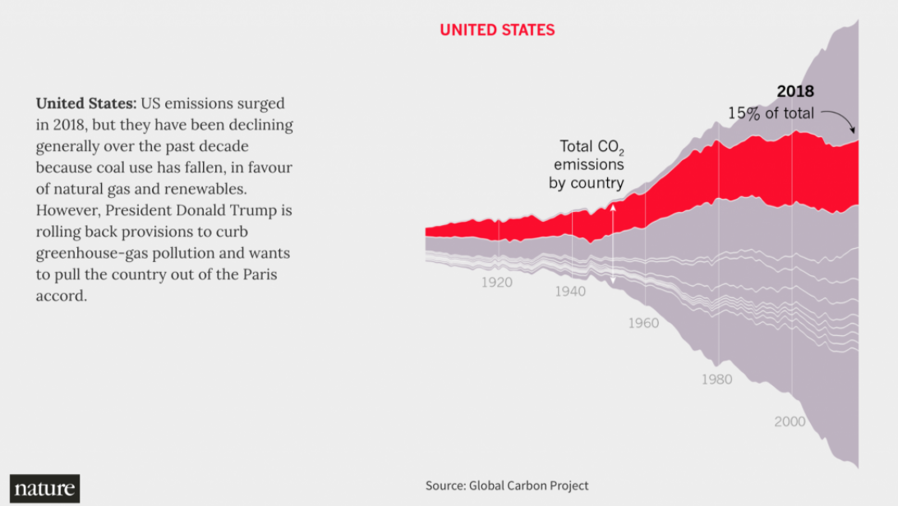
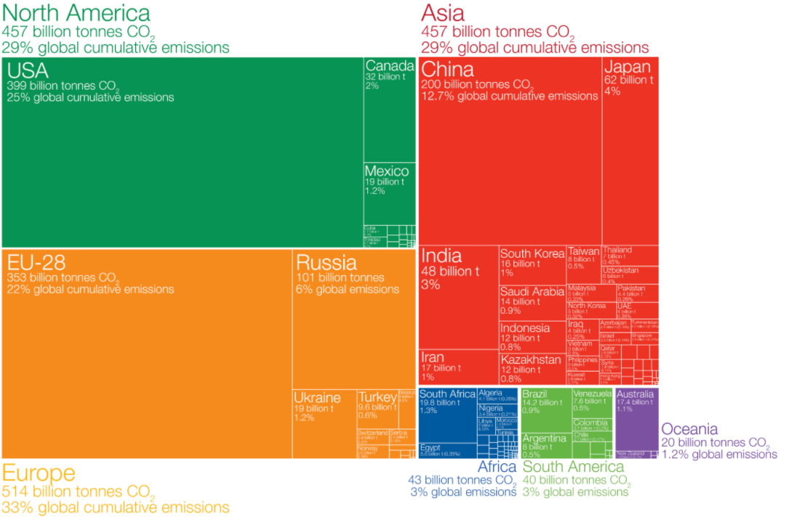

The data vis I looked at this week is about the CO2 emission.
So far topics about CO2 emission are attacting millions of
people's eyes. CO2 relates to the Earth environment, hence
having a direct impact on human lives. The following are two
vis pictures that I found. We can clearly see that these two 
are quite different. The first is kind of like a flow chart
while the second is like a pie chart.

From this chart, we can see the year numbers and the portion
of the CO2 emission by U.S. highlighted by red to the total 
amount of emission. It is easy to see the amount change by years.

From this chart, it is easy to see the amount of CO2 emission 
of one country compared to other countries. Also, because of 
the shape, detailed information can be placed inside of each
rectangle to assist readers understand what the chart is talking about. 
However, I think too much written information on this chart is a
little bit overwhelming.

source link: https://www.storybench.org/five-ways-organizations-are-visualizing-carbon-emissions/