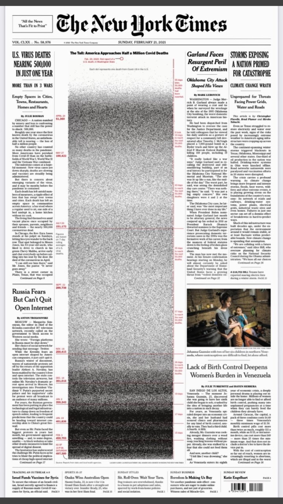

Above is a visualization that can be found at https://static01.nyt.com/images/2021/02/21/nytfrontpage/scan.pdf. Ths was also on the front page of the New York Times February 21, 2021. This may need to be viewed on the actual page where we find to article in order for the visualization to be clearer. 

After reading and seeing this visualization of the progression of COVID in the paper, I was really drawn to how the newspaper decided to display data in this long bar. I was really drawn to the intensity of the dots that are drawn on the visualization. As we move from the top of the mapped data to the bottom, you can see that as we continue to go down, data being mapped progresses with time. 

The intensity of the clustering of the dots is really interesting. On the right side of the bar, we can see notes given to us as the increase of deaths from COVID increases at 50,000 deaths per interval. With each dot representing one death, it was really shocking to see how the rate of deaths increased so much as we continued to go towards the bottom. This can be seen as the bar got increasing way darker at the bottom. This was due to how the rate increased from around 60 days to accumulate 50,000 COVID deaths to just merely 15 days recently. 

While the information being conveyed was the main reason why I chose this visualization and was interested, I further thought that the monochrome color system was really cool. In past visualizations, the interaction of the visualization as well as the vibrant colors is usually what draws me in first, however, with this visualization, it only needed the few colors it utilizes to be effective in conveying their data and peaking interest and understanding. This further was really cool for me to see and it seemed like a new sort of "style" of visualization than what I had previously seen and looked for in a vis. 
