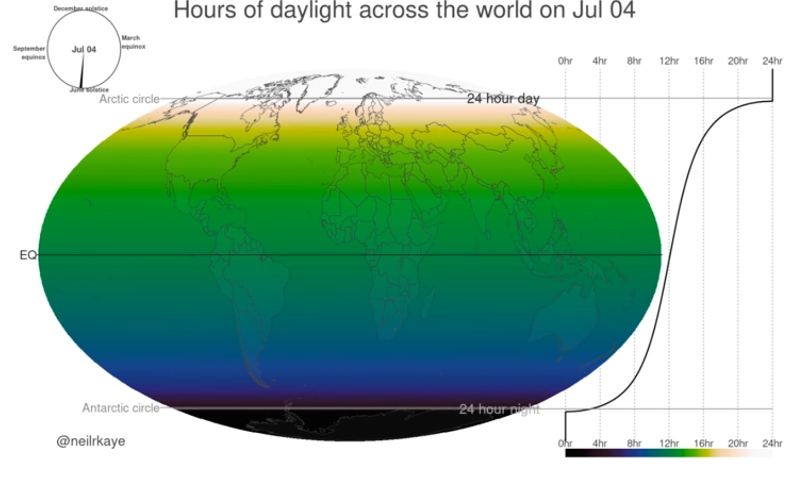

# Hours of Daylight Around the World as the year progresses

## Link: https://www.reddit.com/r/dataisbeautiful/comments/lu9tp6/hours_of_daylight_around_the_world_as_the_year/

## Description

This video is a short animated VIS that shows the hours of daylight across the World from Jun. 1st to Dec 31st. The Visual has a pie-chart that shows the progress of the year during the animation, to give a reference of time passing. This piechart also indicates the occurences of the changes of the seasons. Then, a 2D representation of the earth is color-graded with average hours of daylight. To the right a graph shows the same data, and is interesting to see when it flips around April! This visual was super interesting to me, and was able to simply display a lot of information at once. This can also really help illistrate that the earth is not perfectly rotation around the sun, and some areas of the Earth will be closer and farther away from the sun, changing the hours of daylight significantly.

This graph was also completly made with ggplot, and animation with another library ffmeg. These are tools we used in class, so this VIS can be done in this class. For the final project, if we decide to visualize some form of global data, we can use this project as an inspiration for it.

One of the comments said, "I like the idea that, just for a little bit, the whole world has a 12 hour day/night, and we're all in sync.". This was not something I knew at all, that at certain times of the year, the Earth's entire surface gets an equal amount of sunlight. Conclusions like these can be made from this type of visual data.

## Author's Note
This was created using ggplot in r using data I made with the geosphere package. I animated it with ffmpeg.