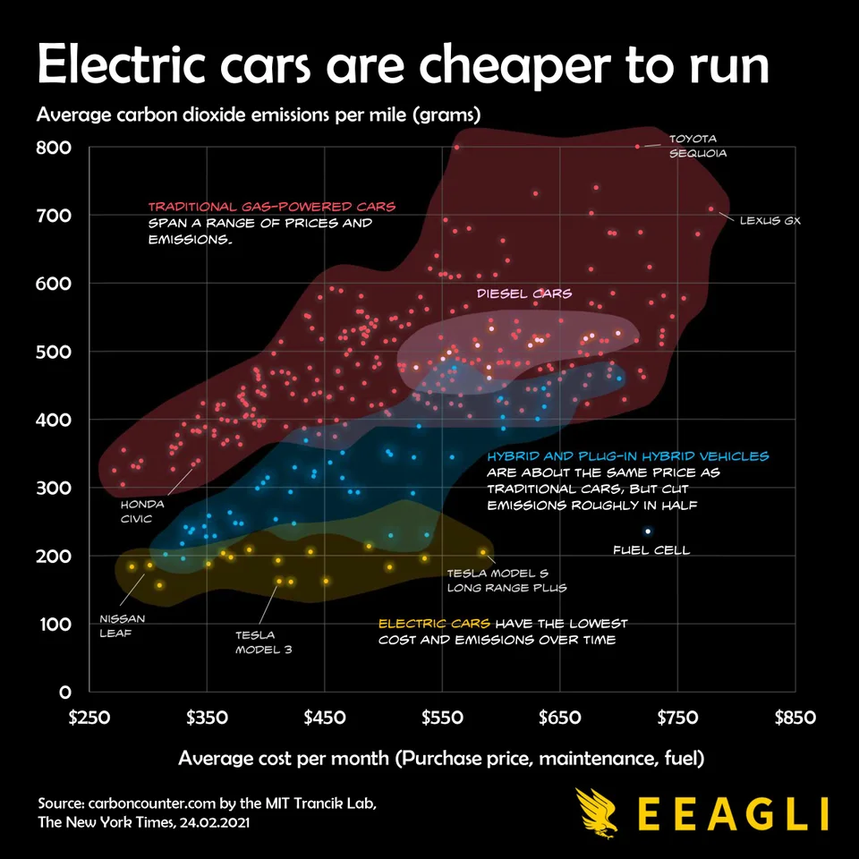

# Reflection, Week 4

Link to visualization(s)

**Link to vis site**:

https://www.chessgraphs.com/

For my fourth reflection, I thought I would check out a vis that I might want to model my final project off of. I am really interested in chess and so wanted to find some vis.

**Reflection**

This graph was very simple and customizable, which is why it was so fascinating. Some features already exist, and some clearly don't, which is why I wanted to reflect on it.

Along the bottom there shows the categorical values (in this case, the chess players). The x axis is time, Y is the chess rating. The axis are customizable to have max and min values. 
The user of the website can select the players along the left column. This could be useful for selecting a small subset of players to compare. The differences in color between the players were less than ideal unfortunately.

The graph can also get busy when there are a lot of users on the map. 

.png)

It would be cool if the highlighting the players name would make it show up highlighted in the graph, or stand out in some way. However, the developers of the graph chose a different functionality/approach. When you move your mouse along the x axis, it updates the current data along with the current ratings of the players at the bottom of the screen, and puts markers on the graph to show what point is being used for this selection. 

**Selecting Players**

There are multiple modes for selecting players. One is geared toward someone casually using the tool to see the highest rated players. However, there is also a searchbox to allow a use case of searching specific users and showing thier development over time (not just a top player!) 
One unfortunate piece of info is that most of the data only extends to 2001 so older players can't really have much information found about them.

Overall, I enjoyed this vis and will likely use it as inspiration for my final project.

