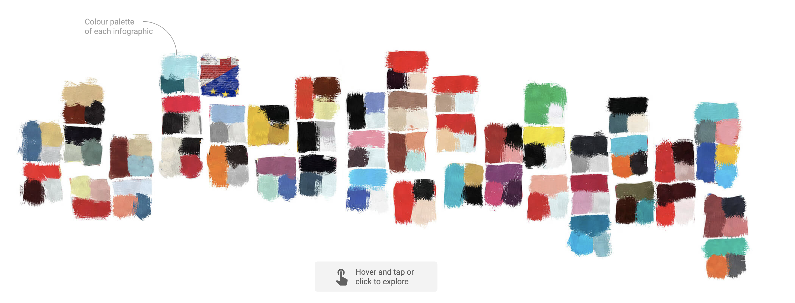
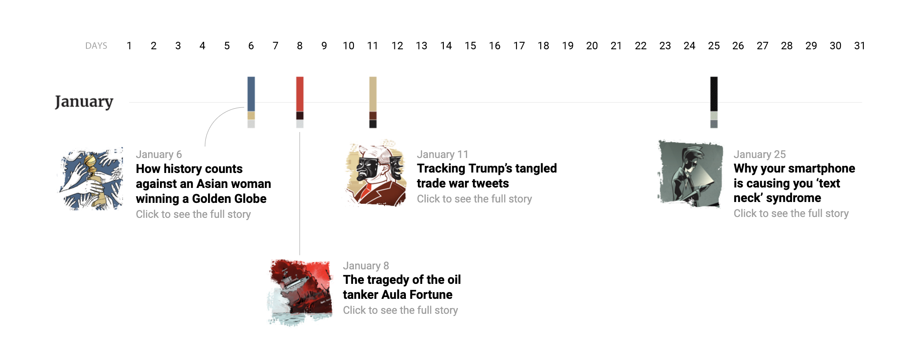

Week 4 Reflection
===

https://multimedia.scmp.com/infographics/article/3043006/colours-scmp-infographics-2019/

This visualization shows all the infographics created by The South China Morning Post in 2019. The first part of this visualization shows squares colored in the color palette of each infographic. When hovered on, a new image appears, and a click leads to the actual infographic. When you scroll down the page, a timeline sorted by month appears, along with the dates the visualizations were published and a short description of each. Hong Kong was a very frequently reported topic, highlighting its controversy and subsequent protests regarding the anti-extradition laws. 

Something very interesting about this visualization is the emphasis it places on the color scheme of each contained article. It is first displayed in the squares at the top, shown broad swatches. On hover, these swatches are replaced with a different, more informative image, in the same palette. Below these squares is a "Colors and Frequency" section representing the colors of each project on a monthly basis. The timeline below uses the same structure expanded and broken down by month, where the project colors mark the publish date. I think representing a year's worth of infographics in this way makes you think about the thought and care that must have gone into choosing color palettes for each infographic: as it relates to data visualization as well as the topics they presented.

