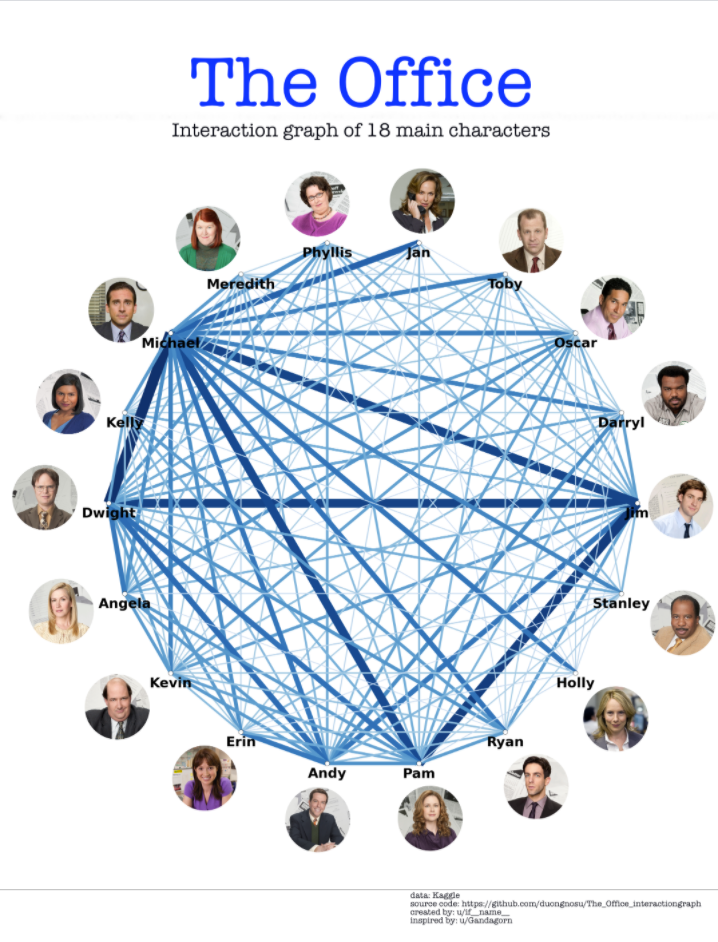

Above is a visualization that can be found at https://www.reddit.com/r/dataisbeautiful/comments/lulc9h/interaction_graph_of_18_characters_in_the_office/. 

The initial reason why I chose this visualization was because The Office is one of my favorite TV Shows. Upon further viewing and analysis of the vis, I found the spatial aspect of where the characters were placed around the graph to be really strategic. I noticed that the characters with the most interaction with one another (Michael, Pam, Jim, and Dwight) were placed not clustered together, but at different points around the graph. I wonder if this would improve the perception of data and make the data more readable for the viewer. 

Another aspect of the graph that I thought was important is in regards to the thickness and boldness of the lines that represent the interaction between characters. I thought the creator's idea to do this was really interesting because color also played a role in this aspect. While the lines got bolder as the interactions between the characters started to increase, the color and darkness of the color also increased. I thought this was a really intuitive means to get the point across to the viewer of the data.

While I'm not sure what I would do to improve the vis, I think adding a mouseover event to show more detailed data would be a neat idea. I think that the while I mentioned above the lines are really intuitive to the viewer (so much so there doesn't appear to be an explanation to explain this on the vis) a mouseover event to clarify the data and present more data to the viewer would be beneficial. Additionally, commenting on the color, the characters with lesser interactions also seem to have lighter colors to represent this which may be difficult to see. Finally, adding this feature would be really beneficial to show the scale of the graph and what constitutes the thickness and boldness of the lines. 
