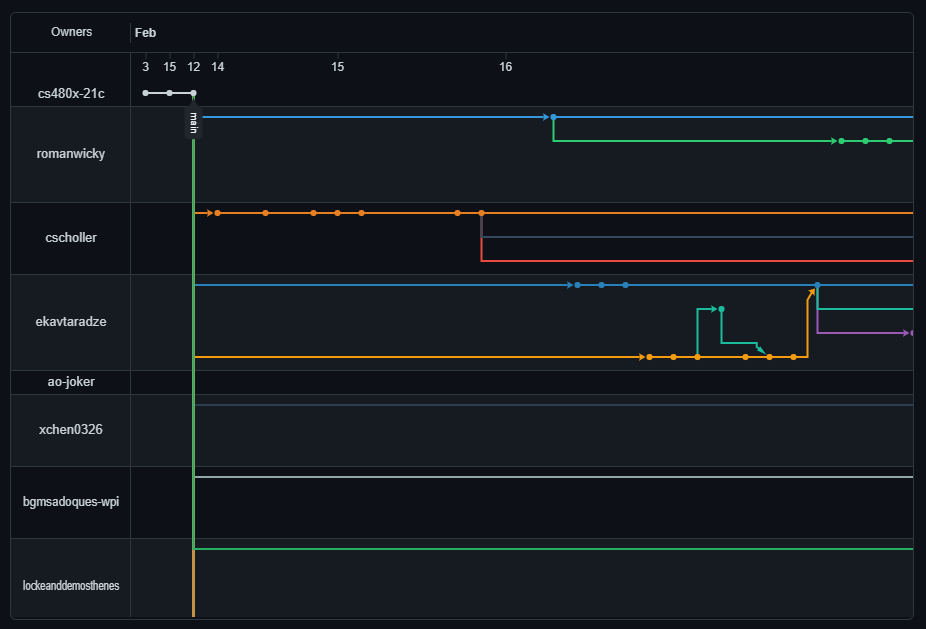
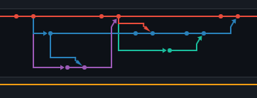
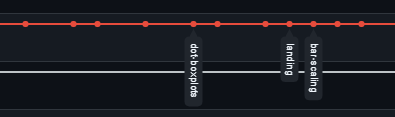
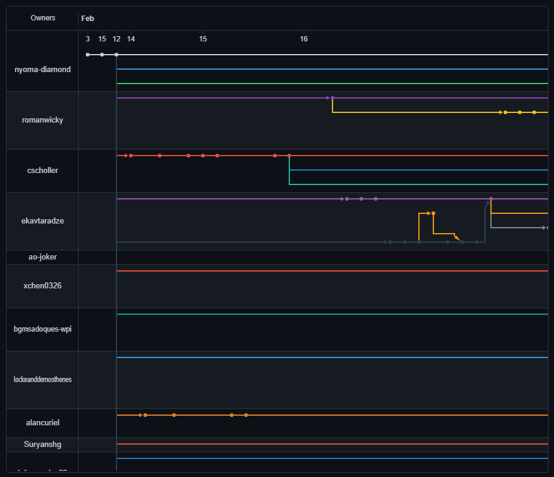

# Week 4 Reflection

This is a bit meta, but a visualization that I find myself looking at a lot is Github's git commit/fork network graph. It's a particularly useful tool for quickly getting an idea of where verious forks of a repository are relative to each other. As an example, the [network graph for Assignment 3](https://github.com/cs480x-21c/03-Experiment/network) is really interesting to look at because it shows not only multiple forks, but multiple people working within each fork.

Because it was a group assignment, you get multiple places where multiple people working in parallel create branches and then merge them into each other before returning to the main branch, creating interesting graphs like this one:

Another interesting thing that Github's network graphs do is they condense branches that are merged in before new changes are made to the branch they diverged from.

This said, there are some notable problems with Github's network graphs. While it is a really useful graphic and is quite visually appealing, its size is limited to a relatively small viewpane no matter how large the browser window. Personally I find the default pane size too small to get a really useful view of the graph, and unfortunately it seems there isn't really any way to work around this (people have tried making workarounds online, but they either don't use Github's graph or they involve hacked together scripts which don't appear to work anymore, as Github has made changes to how the graph is generated and most of how it functions appears to be obfuscated).

Another interesting feature of Github's network graph is that you can select a specific fork to make the primary target of the graph, so rather than looking at all the forks relative to the original repository, you can look at the forks relative to your fork.

## References

- [https://github.com/cs480x-21c/03-Experiment/network](https://github.com/cs480x-21c/03-Experiment/network)
