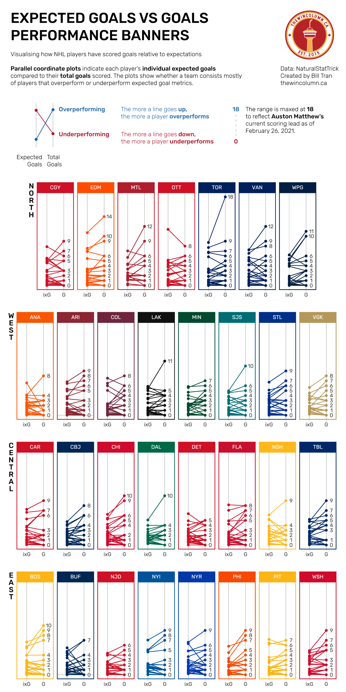

# Week 4 Relection
This week I wanted to learn more about some of the different graph talked about in Visual Analysis and Design. In chapter 7 polar graphs were mentioned. It's a graph I've known
about but never really saw much use of in real world examples. While on r/dataisbeautiful I found this super interesting graphic [visualizing the performance of NHL players for
the current season](https://www.reddit.com/r/dataisbeautiful/comments/ltr34n/oc_visualising_how_nhl_players_have_performed_in/). 

What's really interesitng about this graphic is that you can idenitfy which team and their players are either over or under performing. I overall appreciated the design of the graphic, especially it's readability and spatial design. Additionally the use of each team's primary color is important for distinguish each team. It would have been interesting to find a way to incorporate specific player labels whether by last name or jersey number but I feel that there wouldn't be any accessible way without avoiding visual clutter.
