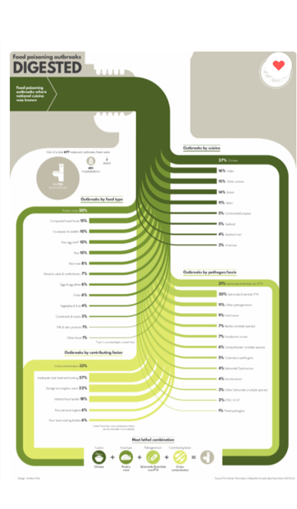

**Adrian Orszulak's Week 4 Reflection**
===
Summary and Description
===
This data visualization was created by Andrew Park for the Beautfiul Arwards Food Poisining Challenge in the static visualization category (He ended up winning recognition and some sum of money). The data visualization, as infered from before, looks at the The data for this visualization was selected from 677 resturant outbreaks where the national cuisine of choice was known. The data visualization can be divided into three sections: the introduction, the body, and the conclusion (these were made by me so the sections are arbitrary to the actual data visualization). In the introduction section, the data visualization states where the data for the visualization is from, as well as displaying the total number of deaths, hospitalizations, and individuals affected from food poisoning. This last statistic is displayed as circles that increase in size with the number of instances. The body breaks down and explores the food poisoning outbreak dataset into four categories: national cuisine, food type, pathogen/toxin responsible, and contributing factor to the outbreak. Each category is represented as a different hue of green - getting lighter over the course of the visualization. For each category, the percent of a paritcular type in the category that is attributed to food poisining is displayed, and a subdivided line representative of the percentage accompanies this from a central line of that color. For example, in the food type category, poultry meat represents 20% of outbreaks. This data is shown on the data visualization and a line representing 20% is pulled from the central line of that color. In another instance of the same category, milk and dairy products account for 1% of food poisoning outbreaks. This data is shown on the data visualizationand a line representing 1% is pulled from the central line of the same color - the exact same color line as the poultry meat. Of all the categories, the types that were the largest had the subdivided line followed to the conclusion section. In the conclusion, the largest types from each category were pulled together and the most "lethal" combination was extrapolated to conclude the best liklihood to the obtain a bad case of food poisining. This data visualization was likely made for enjoyment. The data visualization is meant to take the data and show the various attributes of the data set, especially since the data visualization was made for a challenge competition. There is one aspect of presentation in the conclusion section of the data visualization.  

The data visualization mainly uses table set data. This data consists of qualitative data (the categories and types within the category) and quantitative data (the totals of the types within the category, number of deaths, number of hospitatization, and the number of individuals affected). In terms of the qualitative data, the categories and types within the categories are separated in different hues of green. In terms of the quantitative data, the number of deaths, hospitatilizations, and affected individuals are presented as circles that increase in size corresponding to the number of instances. In addition, the totals of the types were summed, and then percentage of each individual type of all the types in that category was calculated and displayed. Another fun note is the extrapolation for the "lethal" food poisoning combination with some fun humor.

Improvements Moving Forward
===
There are not any real improvements that I can note. The data visualization is extremely well created. The only note that I would make is that the sole use of green may make it difficult for color blind individuals to denote the different colors for the categories. 

Images
===

Pictured above is the visualization from the blog found in the citations. I could not copy nor save the image so it appears blurry. It would be better to see if from the website below.

References
===
1. [This link leads to the one of many articles/blogs that has posted this data visualization. This one makes the visualization easy to see](https://visual.ly/community/Infographics/health/food-poisoning-outbreaks-digested)
