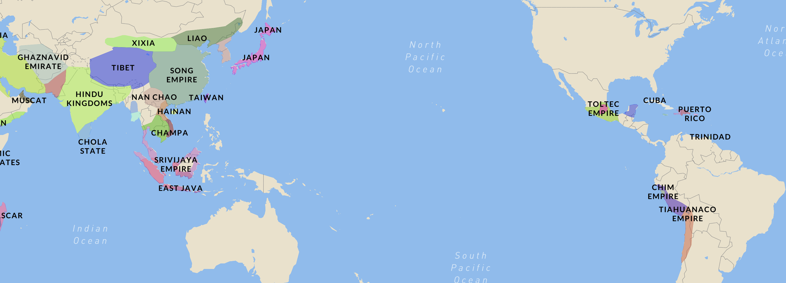

<h1>Week 4 Reflection</h1>
<h3>Reflection type: Viz Review</h3>
<h2>https://historicborders.app/?view=globe%20[OC]</h2>

<h2>Civilizations Over time</h2>
<h3>I chose this visual because I thought it was a really incredible viz that held my attention for far longer than originally intended. I found this viz on r/dataisbeautiful and I spent about an hour going through the 10+ years provided and got to see what civilizations existed at the same time. This was super interesting because of the new things I learned, the context the visual provided, and a sense of scale that I hadnt appreciated. The new things I learned included the existance of entire civilizations I had never heard of which is mind blowing to me. The context provided was incredible in a spatial and temporal sense. I had no idea that the massachusetts bay colony and the holy roman empire existed at the same time, this visual really helped me break down preconcieved notions about history. The sense of scale provided by being able to one compare the size of civilizations next to each other is helpful but also seeing the worlds land become more separated and claimed over time was also interesting. The interactivity of this map is also key to its use. By being able to scroll and zoom around the map you can change the scope of how you view how the civilizations may have interacted. I thought looking at the globe and seeing asian civiliations and native american civilizations across the pacific and thought it was really interesting.</h3>