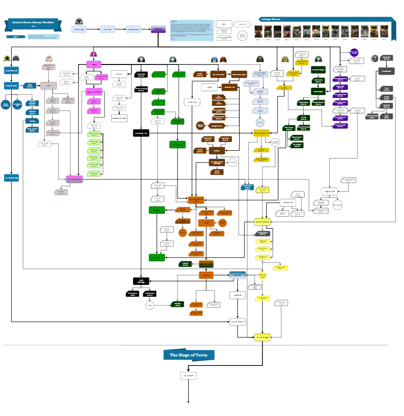
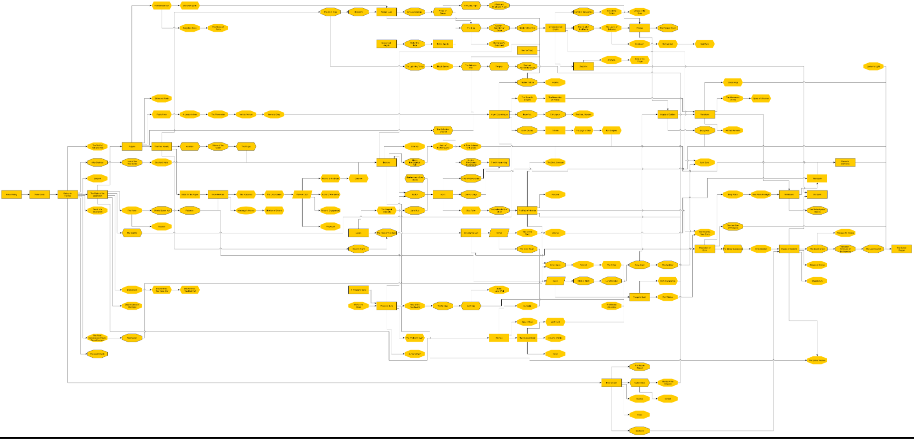

# Reflection Week 5

My reflection is on an amazing flow chart made for a fictional series. The flow chart denotes the book order per legion (comparable to faction) for all 10 of the main legions
in the fantasy universe. The flow chart is interactable, each entry can be hovered over to bring up a window with an image of the book, the entries when clicked on link to a wiki entry 
for their respective book. What I like about the visualization is how condensed it is, especially when compared to other attempts at the same visualisation which turned out to be
largly unreadable. 

Some negatives for this visualization are that it is still very cramped and hard to read and another minor concern is that large portion of the thumbnails do not display properly. My addition to this 
visualization would be to make it so that you could select a legion and that legions path would become larger so that you could better see and read the books for that legion.

The new visualization, each color denotes a different legion and a different "story line" 

The old visualization, confusing to the point of being more of a nuisance than an actual help.

Website for new: http://www.kylebb.com/HH/HHSeriesOrder.html
Website for old: https://i.imgur.com/TTlOno6.png
