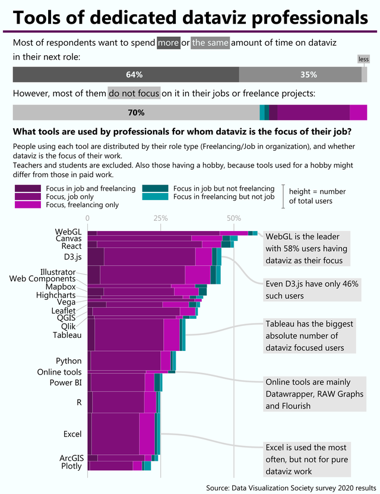

# Tools of Dedicated Datavis Professionals

## Link: https://www.reddit.com/r/dataisbeautiful/comments/lzohca/tools_of_dedicated_dataviz_professionals_oc/

## Description

This vis was made using R and Inkscape. This vertical bargraph shows what tools used by professionals where dataviz is the focus on the job. 58% of WebGL Users that answered the surveys focus mainly on dataviz. Not too far behind, D3.js (the main tool we are using in this class) is at 46%. I thought this graph was cool because it involved a stacked vertical abrchart, with coloration to show the difference in focus levels, and the thickness of each bar would signify the numbers of users for that library. Excel is the most used tool out of the professional industry, but is the least used for visualization focus. WebGL, Canvas, and React all almost have 50% of their user base focused only on visualization. Some of the least used tools involve Qlik, Vega, and Highcharts. 

What I would have changed about the visual is the odd color choices. Some of the colors have really close hue's and if this data were to become large enough, the color choice would make it harder to distinguish the different levels of each stacked bar. I would have gone with some other kind of coloration, probably making each level their own individual color that is easy to distinguish between other colors. Following that, the labeling is very hard to distinguish which tool belongs to which graph. Some of the lines are very small and cause them to be stacked closely with other bargraphs, and it makes it hard to follow the line that points from the barchart to the library name. The way this graph is made makes it difficult to accuratly distinguish each line from another. 

## Sources

Author's Note:
Tools: R + Inkscape

Data source: Data Visualization Society 2020 Census

There are variety of tools to do dataviz and for someone who is just starting it is quite difficult to select which one to learn. One possible criteria might be whether this tool is used by professions focused on dataviz. R is focused on statistical analysis, Excel on spreadsheets, and python might be used for everything. So what is the tool which dedicated dataviz professionals use? The conclusion is that there is no such tool, because dataviz is more like a skill useful in many cases (financial reporting, UX design, journalism, etc.) rather than a profession by itself.
