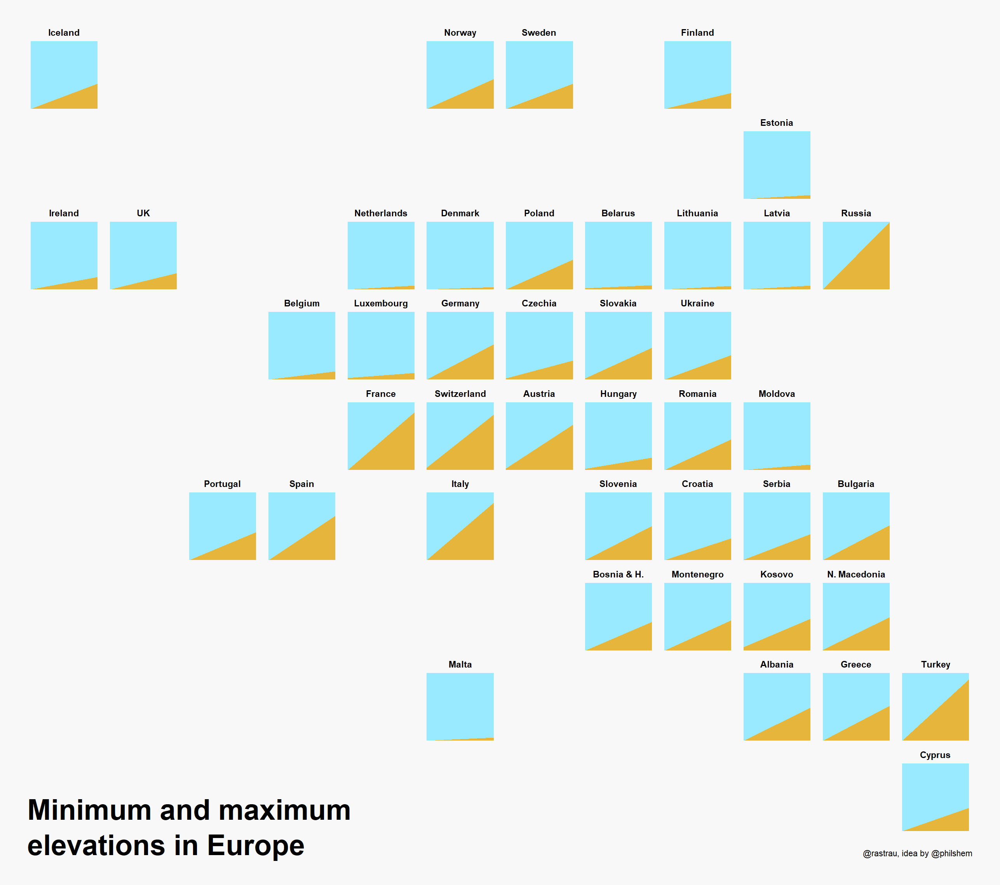
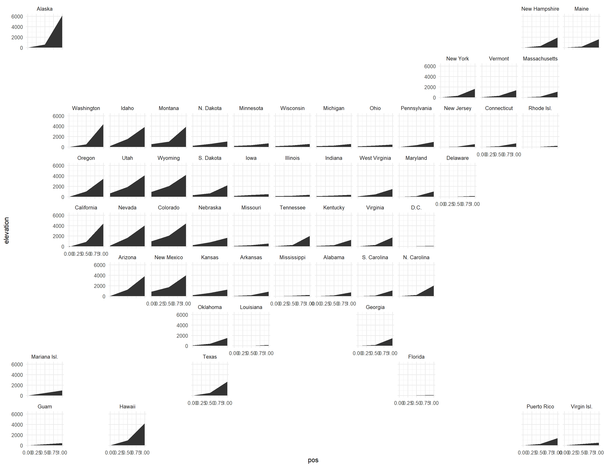

# Week 5 Reflection

I found the visualizations in [this](https://www.reddit.com/r/dataisbeautiful/comments/lwa0ov/oc_minimum_mean_and_maximum_elevation_per_state/) reddit thread particularly interesting, not really because of what the information itself displays, but because it displays a format that is interestingly versatile. More often than not, when I think about data that involves location and time, I imagine an animation scrolling through time displaying changes on the map as time progresses, however, should the exact shape of the geography not be important, you can replace regions such as states or countries with their own relatively positioned graphs. This means you can look at all the information simultaneously as opposed to needing to scrub through a timeline. Alternatively, this could be used in conjunction with time scrubbing to show even more data. It is a rather effective method of displaying data particularly densely.

Now in reference to the content of the visualization itself, while interesting, I don't really agree with the choices made in the visualization. Using line charts sort of loses a sense of scale within each section and makes it hard to really compare things. It might make more sense if bar charts were used instead.

This said, the creator also has a [github repository](https://github.com/rastrau/elevation-slopegraphs) displaying more versions of the visualizations, notably versions that actually have axis labels.

It doesn't really show a lot, but I think it's really interesting given how it could be used for other data types.
