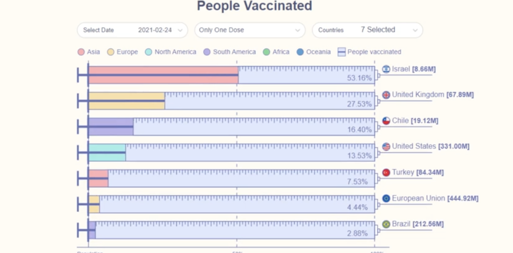

Week 5 Reflection
===

https://www.reddit.com/r/dataisbeautiful/comments/lydx57/oc_we_are_getting_there_vaccination_progress_by/

This visualization shows the COVID-19 vaccination progress of several countries. It is a video that displays the percent of the population vaccinated in the form of stylized horizontal bar graphs from January 1st, 2021, to March 4, 2021. The included countries are Isreal, the United Kingdom, Brazil, Chile, the European Union, Turkey, and the United States. There are several additional pieces of information and measurements displayed here: for example, the graph only shows people who have displayed a single dose. Each country's bar is colored according to the continent lengend, and next to the country's name is the number of people vaccinated (measured in millions instead of percentage). Finally, the ticks on each bar as well as the 50% progress mark helps users visualize the percentage shown. 

I thought the way the creator stylized the bars (as liquid in a syringe, representing the COVID vaccine) was clever and well-executed. The visualization as a whole was clean and informative, with an appropiate color scheme. The title, however is a bit lacking in information: we can of course assume that this shows the global COVID-19 vaccination process, but "People Vaccinated" leaves a bit to be desired. 

