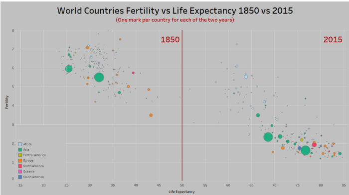
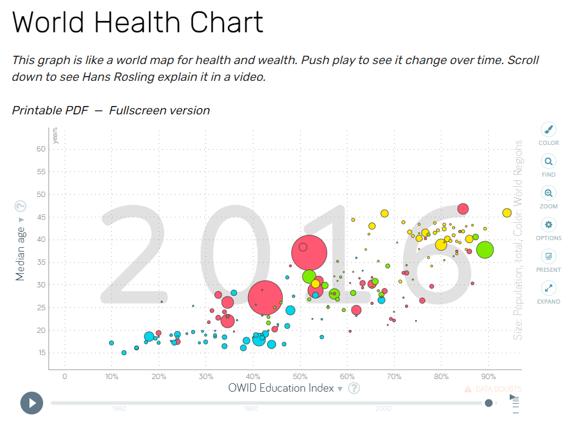

### Original Vis and Critique

Original Vis, Uncovered on r/dataisbeautiful subreddit

(Post linked [Here](https://www.reddit.com/r/dataisbeautiful/comments/lz8t2i/fertility_vs_life_expectancy_1850_vs_2015_oc_see/))

This original vis has a very specific use case in my opinion. It is meant to show the person looking at the picture that since 1850, there have been dramatic increases in life expectancy and birth rates accross the entire world.
When I first looked over this vis, I thought that the use case was very specific, and I wished I had more access to the underlying data to explore as I chose to. Also, I wished for interaction so that I could see more detailed information on each element in the vis.
The use casee was very specific, but it pulled from a bigger, and more general, data pool. This generic data pool had a vis that allowed you to choose between many different dimensions, and vary by time as well.
I've linked it below:

(Link [Here](https://www.gapminder.org/fw/world-health-chart/))

#### Reflection and Motivation to select this for remix project

When a user is utilizing a two axis scatter that changes over time, they may want to explore a tight geographical region. The vis on this website did have a search feature, but then you have to search one at a time and they are organized by name. I found myself intrigued by the life expectancy dip during WWI in many countries (discovered using the generic graph tool), I would love to zoom in on Europe and see how the life expectancies changes geographically year over year, but this isn't possible in the current vis.
I'd love to be able to just move my mouse over to a country and see what its value is rather than remembering the country name and searching it in a box. This fulfills more of a search task but also a new kind of browse task. After all, geographically looking through the data is different than exploring the scatter plot.  

This vis was an instructive week of reflections for me because it was very well put together, unlike some of my previous week choices. However, there seemed to be different use cases and tasks that this vis didn't address. I think it was a valuable lesson to me about seeing in a real world example a case of the task at hand being the most important part of the vis idiom design process. 