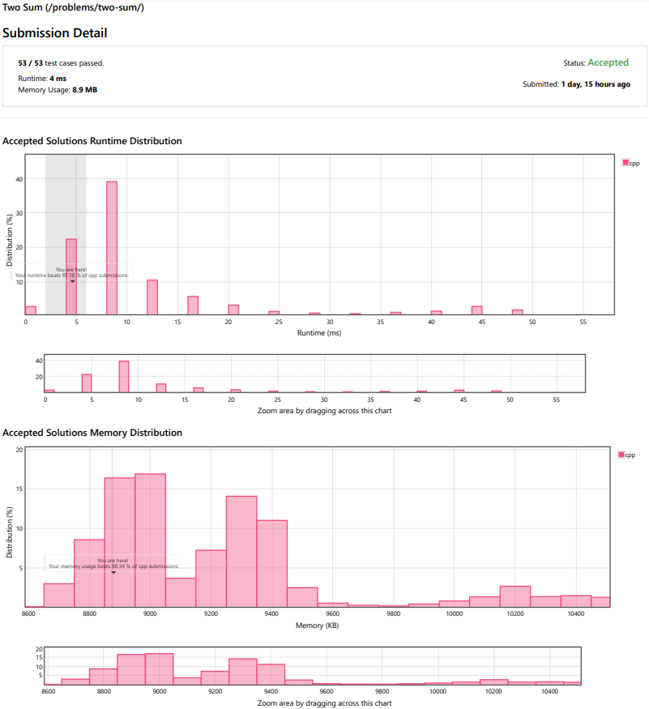
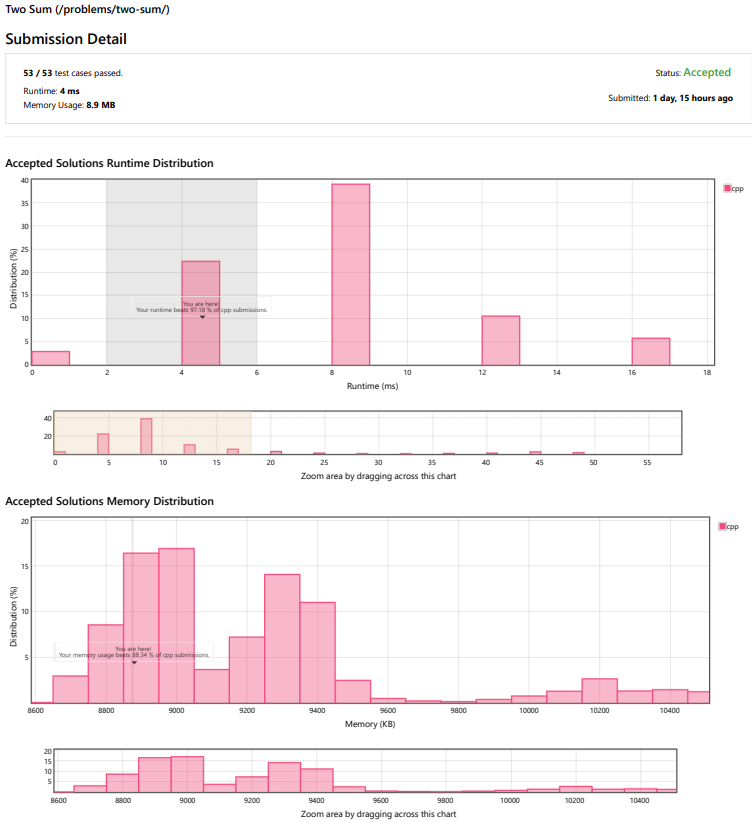
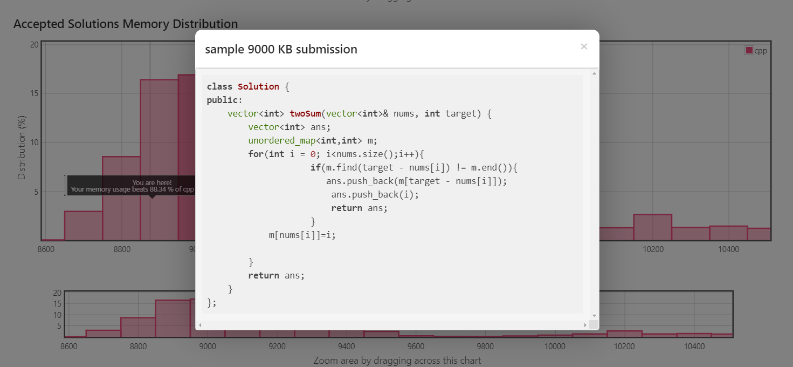

Data vis -

After a submission on LeetCode the user is able to view a detailed vis showing how their solution stacks up to other solutions in both run time and memory usage. The view also can be used by highlighting a portion of the graph and individual bars can be selected to view the code used for a particular solution.

This visualization is useful as it gives the user an idea of how their solution stacks up to others, and it also invites the user to explore other solutions, to improve themselves or get a higher score. One element that I would like included is the inclusion of multiple languages as it would be interesting to see how other languages stack up in these categories. This addition would be a simple implementation as the website already has this view with other languages as well. All that is necessary would be a legend with interactive elements to enable or disable those of interest.
