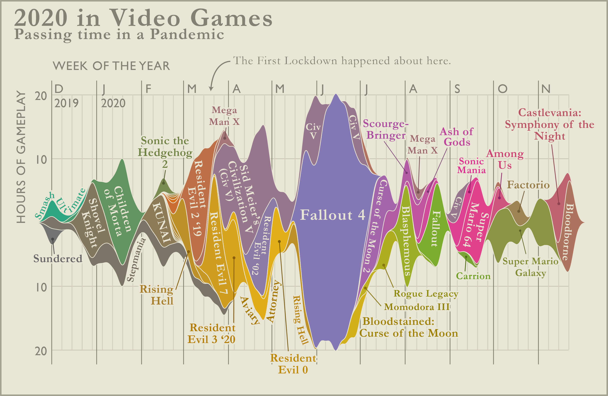

<h1>Week 5 Reflection</h1>
<h3>Reflection type: Viz Review</h3>
<h2>https://www.reddit.com/r/dataisbeautiful/comments/lvagbz/i_tracked_all_of_my_gaming_time_between_december/</h2>

<h2>2020 Video Games</h2>
<h3>I chose this visual because I thought it was a very interesting study to do and I thought it was something that could be a really interesting social experiement. If one created an app that functioned almost like a diary but it just logged daily activity you could create a daily generated  graph like this of daily activity. I think that visualization would be a really powerful reflective tool, but honestly kind of scary. This would best be done though as a part of a number of visualizations. I thought this one in particular was very relatable to my time in the pandemic, Im jealous of his colletion! I think this visual really would be best alongside other visuals that are more focused on data delivery, like stacked bar charts of data or graphs of change in hours played over time. This would provide an interesting tool as well as an interesting infographic to share how you spend your time! Making this visual seems rather difficult to do algorithmically though, given the mix of colors and oddly shaped area. In terms of improving this visual specifically, I think the use of labeling large areas but small ones could use some other kinda of identification method as Aviary Attorney was very hard to read. Also, the Y axis also confused me as it has no sign change past zero but it isnt symetrical which is hard for me to rationalize. This visual might have inspired a future viz project!/h3>