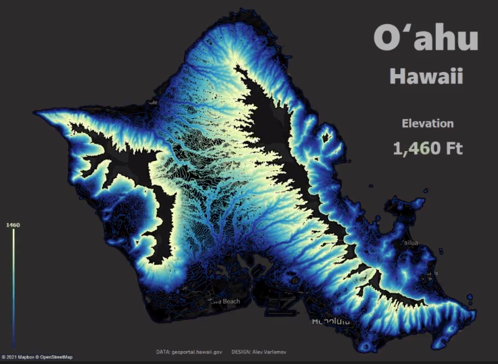

This week I wanted to continue looking at elevation data and found this [animated visual of the elevation line in Oahu Hawaii](https://www.reddit.com/r/dataisbeautiful/comments/m0aztx/oc_elevation_lines_of_oahu_hawaii/)
I really appreciate the scale and color scheme for the elevation lines with a growing current value to help inform the viewer. Beyond being visually appealing I found the visual 
to be incredibly informative. 
