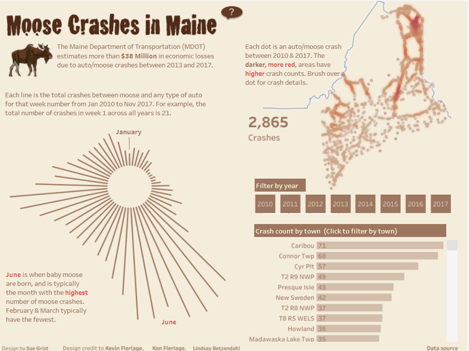
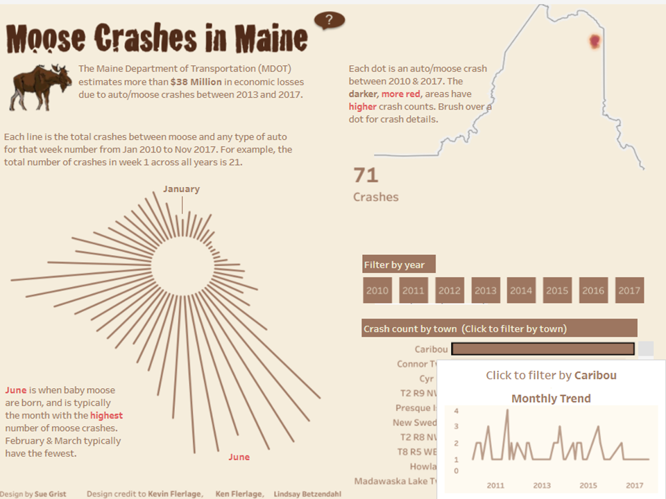
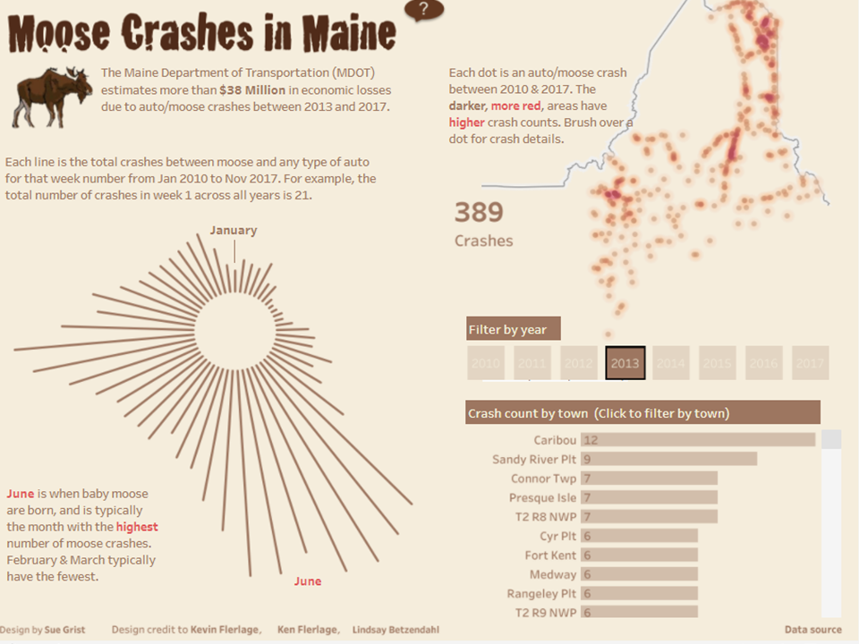
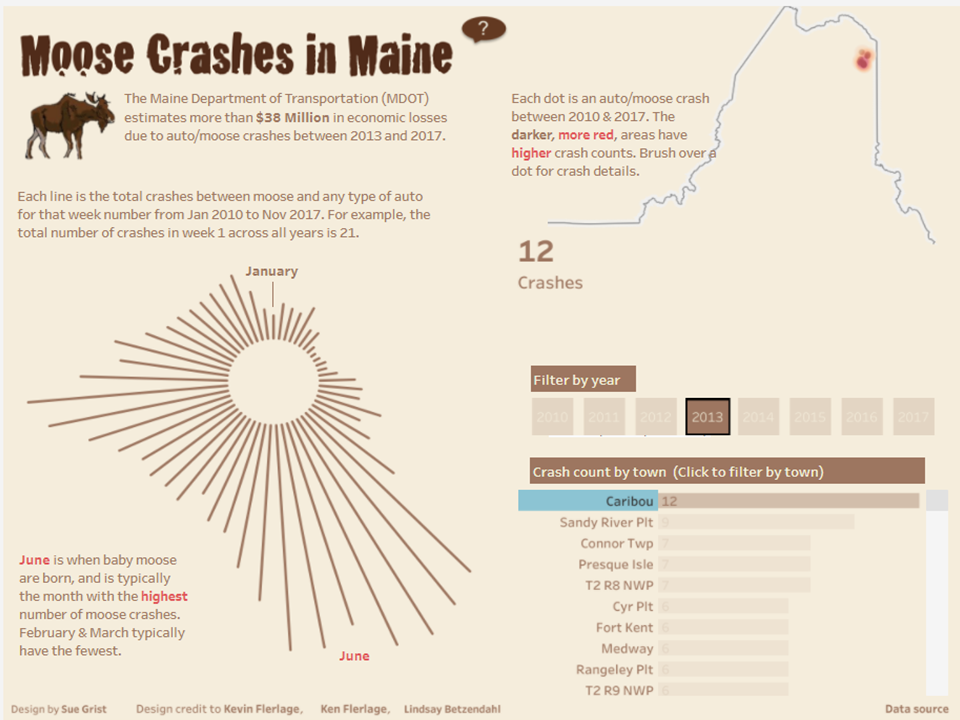

**Adrian Orszulak's Week 5 Reflection**
===
Summary and Description
===
This data visualization was created by Sue Grist with additional design credits given to Kevin Flerlage, Ken Flerage, and Lindsay Betzendahl. The data visualization looks at a dataset of moose crashes, instances where an automobile crashed into a moose, within the state of Maine from 2010 to 2017. This is of particular interest to the Maine Department of Transportation (MDOT) becuase of the large economic cost these crashes incur. There are three parts to this visualization. In the first part, a background on moose crashes in Maine is provided. In addition, a question mark within a bubble contains information on the dataset and some instruction in guiding the user in using the infogrpahic. The second part provides a radial oriented bar chart that indicates the number of crashes from January 2010 to November 2017 for each week in the year over the course of those four years. The radial bar chart has indicated the months of January and June. This radial bar chart is accompianed by a short description as well. The final part includes a map of automobile/moose crashes in the state of main. These crashes are represented by slightly opaque dots. The darker and more red the areas are, the higher the number of automobile/moose crashes that have occurred in that area. Alongside this spatial graph, a horizontal, rectilinear bar chart showing the number of crashes in each town is displayed. As an added feature, one can filter the spatial map by year to highlight the crashes in a particular year, by town to highlight the crashes in a particular town, or by both attributes to highlight the crashes by town and by year. When hovering over a selected town, a line graph of the monthly trend of crashes for each year. This data visualization is meant for presentation. Given the economic damage previously mentioned, it would be important for MDOT to know where these crashes are most likely to occur, where their efforts should be directed, when these efforts need to be in place, and when the most dangeous time for crashes is. Additionally, the term crashes used in the data visualization in place of other terms such as accidents conveys this idea of presentation.

This data visualization uses table set data and spatial data. Firstly, the table set data is displayed in the number of crashes by town in a rectilinear, horizontal bar chart, and the number of crashes each week of the year over the 7 year period in a radial bar chart. Secondly, the spatial data is represented as points in particular towns in the state of Maine. The number of accidents is represented by how dark and red particular areas of the spatial map are. The data has attributes for year and town as indicated in the interactivity of the spatial map of Maine. The color gradient used in the spatial map is very useful, as previous discussion on papers in lecture have indicated the usefulness of brown to red gradients. The moose at the top right of the data visualization is a nice touch.

Improvements Moving Forward
===
There are a couple of improvements that could be made to the infographic moving forward. Firstly, the radial graph is a bit confusing. Without the little blurb to the side, you could not tell that the graph is oriented clockwise as opposed to counter-clockwise. Without reading the short blurb, the data for crashes in the months between January and June cannot be easily discerned. Adding to the legend of the radial bar chart would be helpful. Secondly, the line graph that appears for a selected city of the number of crashes monthly is confusing. The x-axis is labeled in years whereas the graph indicates it displays crashes during each month. Editing the line graph to show or highlight individual months or adjusting the graph to indicates crashes in each year would solve this problem.

Images
===

Pictured above is the data visualization plainly. This is what would appear when first loaded. The data is between 2010 and 2017.

Pictured above is the data visualization, but one specific town in Maine (in this case Cairbou) was selected. The mouse hovers over that particular city to reveal a line graph of the monthly trend for every year.

Pictured above is the data visualization, but one specific year (in this case 2013) was selected. 

Pictured above is the data visualization with one specific city (Cairbou) and one specific year (2013) selected. This mathcing can be done for all cities and years as well.

References
===
1. [This is the source of visualization in Tableau Public](https://public.tableau.com/en-us/gallery/moose-crashes-maine?tab=viz-of-the-day&type=viz-of-the-day)