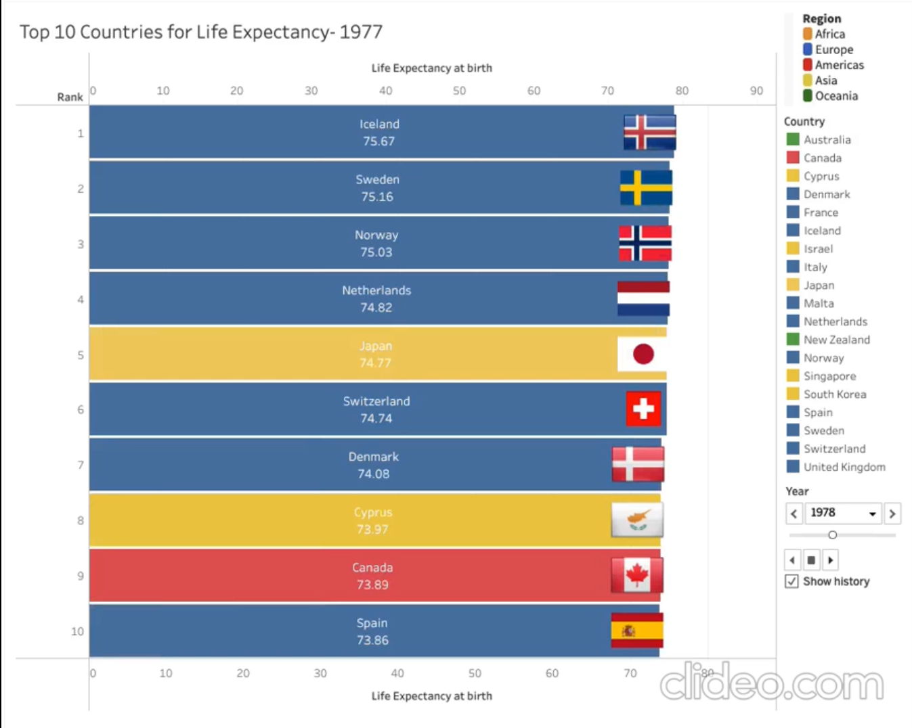

Above is a visualization that can be found at https://www.reddit.com/r/dataisbeautiful/comments/m0i3gy/oc_asian_countries_are_chasing_up_to_european/. 

The video clip of the visualization displays how over time, the life expectancy since 1950 has shifted. Historically, the life expectancy of European nations have been higher than most other countries in the world. Since recently, beginning at the early 2000s, Asian countries have inched up the list of top 10 countries with the highest life expectancies. In 2019, 4/10 Asian countries were in the top ten with 2 listing at the top 3. Some of these asian countries include Japan, Singapore, South Korea, and Cyprus. 

The interactive visualization was really interesting to me at first glance because all the features were set on the side of the vis. The slider allows the user to be able to shift through the year and visualize the top 10 countries with the highest life expectancy easily. It allows the user to view the data of at that particular year. I thought that since we are working on different mappings of one visualization while also recently being introduced to user interactions, this was a really neat way to allow for more usability. This technique has been used a lot in the past and other visualizations I've seen. 

The only suggestions and confusion that I had when viewing this briefly was on the side bar, it displayed a list of countries. With no description that I could find, this list of countries was very confusing. I would assume that that's the list of countries that has every appeared on the chart throughout the years but I'm not sure. This was very unclear for me.

Overall, I thought that this visualization was really well put together and it allowed for user interaction which is always a cool technical and design feature to me. 
