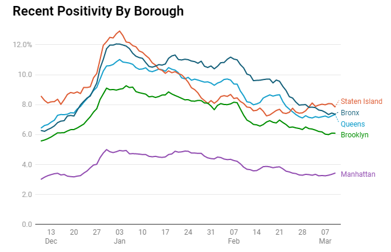

# Week 6 Reflection

This week I found a [relatively uninteresting set of visualizations on COVID data in New York City](https://gothamist.com/news/coronavirus-statistics-tracking-epidemic-new-york). The reason IU thought they were notable is because they add some interesting quality-of-life improvements which make the visuals surprisingly more usable for how little impact they have.

This map is relatively unusual. Throughout the pandemic we've seen maps like this over and over. The thing which a lot of them miss is that you sort of lose perspective as a result of the color scale. Color scales such as this don't really give you a good reference for the difference between areas. The thing which this visualization does which I find interesting is when hovering over a region, not only does it show a tooltip with data for that area, but it also brings up an indicator on the legend. This indicator is also animated, meaning if you want you can jump between two regions to see the indicator move, giving more meaning to the difference in color.

The page also has other visualizations which apply similar quality-of-life improvements, such as the line charts and scatter plots. Again, despite being relatively uninteresting on their own, they have nice improvements like desaturating the other lines or categories if you hover over one for long enough, which makes it easier to focus on one particular line or category in a scatter plot (though this could potentially be handled using filters, but this is a rather elegant alternative).

## References

- [https://gothamist.com/news/coronavirus-statistics-tracking-epidemic-new-york](https://gothamist.com/news/coronavirus-statistics-tracking-epidemic-new-york)
